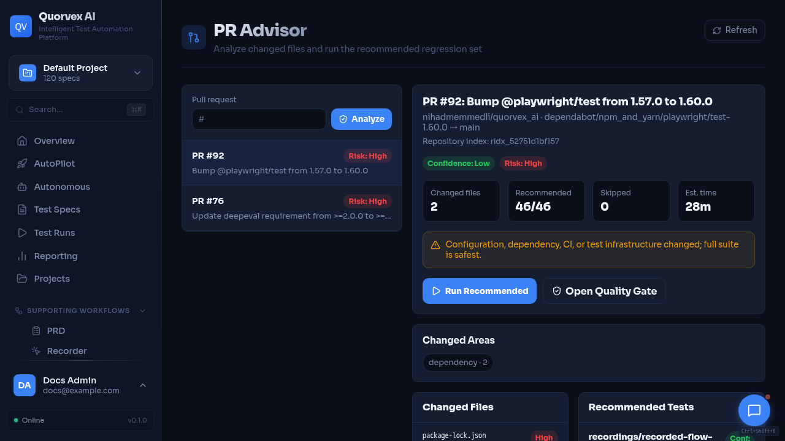

# GitHub Operations Dry-Run Follow-up

PR advisor dashboard used to review repository operations and pull request status.

Generated on 2026-06-19 after PR #168 was merged into `refactor/staged-foundation`.

This report is intentionally non-mutating. It records current GitHub state from read-only `gh` queries and the follow-up actions that still require explicit maintainer approval.

## Source Inputs

- Playbook: `docs/community/github-refresh-operations.md`
- Desired labels: `.github/labels.yml`
- Repository: `NihadMemmedli/quorvex_ai`
- Integration branch: `refactor/staged-foundation`
- PR #168 merge commit: `2caa5d9`
- Included PR #168 head commit: `0b280d1`

## Actions Not Taken

- Did not sync, rename, or delete labels.
- Did not create replacement or professionalization issues.
- Did not comment on, close, relabel, rerun, rebase, or merge issues or PRs.
- Did not edit repository settings, topics, environments, branch protection, or Pages settings.

## Label Audit

The live repository currently has 9 labels:

| Live label | Color | Description |
| --- | --- | --- |
| `bug` | `d73a4a` | Something isn't working |
| `documentation` | `0075ca` | Improvements or additions to documentation |
| `duplicate` | `cfd3d7` | This issue or pull request already exists |
| `enhancement` | `a2eeef` | New feature or request |
| `good first issue` | `7057ff` | Good for newcomers |
| `help wanted` | `008672` | Extra attention is needed |
| `invalid` | `e4e669` | This doesn't seem right |
| `question` | `d876e3` | Further information is requested |
| `wontfix` | `ffffff` | This will not be worked on |

The desired taxonomy in `.github/labels.yml` contains 28 labels. None of the desired labels currently exists by exact name in the live repository.

Missing desired labels:

| Group | Labels |
| --- | --- |
| Type | `type:bug`, `type:enhancement`, `type:docs`, `type:maintenance`, `type:security` |
| Area | `area:backend`, `area:frontend`, `area:agents`, `area:playwright`, `area:docs`, `area:ci`, `area:docker`, `area:deployment`, `area:dependencies`, `area:tools`, `area:python`, `area:node` |
| Priority | `priority:p0`, `priority:p1`, `priority:p2`, `priority:p3` |
| Effort | `effort:small`, `effort:medium`, `effort:large` |
| Status | `status:needs-triage`, `status:ready`, `status:blocked`, `status:replaced` |

Existing live labels not declared in `.github/labels.yml`:

`bug`, `documentation`, `duplicate`, `enhancement`, `good first issue`, `help wanted`, `invalid`, `question`, `wontfix`

Dry-run recommendation: sync the 28 desired labels only after approval. Decide separately whether default labels should remain as aliases, be renamed, or be deleted.

## Replaced Issue Audit

The playbook marks issues `#18`, `#21`, `#25`, and `#49` as replaced. All four remain open.

| Issue | State | Current labels | Replacement from playbook |
| --- | --- | --- | --- |
| [#18](https://github.com/NihadMemmedli/quorvex_ai/issues/18) Add more example test specs for common scenarios (login, signup, search) | Open | `help wanted`, `good first issue` | Create curated demo spec catalog for onboarding and docs |
| [#21](https://github.com/NihadMemmedli/quorvex_ai/issues/21) Create spec templates for popular web apps (TodoMVC, HackerNews) | Open | `help wanted`, `good first issue` | Create curated demo spec catalog for onboarding and docs |
| [#25](https://github.com/NihadMemmedli/quorvex_ai/issues/25) Improve CLI output formatting with colors and progress indicators | Open | `help wanted`, `good first issue` | Audit CLI output boundaries: user-facing print vs structured logging |
| [#49](https://github.com/NihadMemmedli/quorvex_ai/issues/49) Replace print() Calls with logger in cli.py | Open | `enhancement`, `good first issue` | Audit CLI output boundaries: user-facing print vs structured logging |

Dry-run recommendation: create the two replacement issues first, then comment on and close the replaced issues with the replacement issue links after approval.

## Dependabot PR Audit

There are 16 open Dependabot PRs. All currently target `main`, not `refactor/staged-foundation`.

### Conflicting PRs

These PRs are not mergeable without conflict resolution. Their latest check runs are also stale, from 2026-03-01.

| PR | Base | Merge state | Failing checks |
| --- | --- | --- | --- |
| [#35](https://github.com/NihadMemmedli/quorvex_ai/pull/35) Bump `@ai-sdk/anthropic` from 3.0.44 to 3.0.50 in `/web` | `main` | `CONFLICTING` / `DIRTY` | `python-checks` |
| [#34](https://github.com/NihadMemmedli/quorvex_ai/pull/34) Bump `ai` from 6.0.86 to 6.0.105 in `/web` | `main` | `CONFLICTING` / `DIRTY` | `python-checks` |
| [#33](https://github.com/NihadMemmedli/quorvex_ai/pull/33) Bump `@types/node` from 20.19.27 to 25.3.3 in `/web` | `main` | `CONFLICTING` / `DIRTY` | `python-checks` |
| [#32](https://github.com/NihadMemmedli/quorvex_ai/pull/32) Bump `autoprefixer` from 10.4.23 to 10.4.27 in `/web` | `main` | `CONFLICTING` / `DIRTY` | `python-checks` |
| [#30](https://github.com/NihadMemmedli/quorvex_ai/pull/30) Bump `react-dom` from 19.2.3 to 19.2.4 in `/web` | `main` | `CONFLICTING` / `DIRTY` | `python-checks`, `node-checks` |

### Mergeable but Unstable PRs

These PRs are technically mergeable, but have failing checks and stale bases. They should not be merged into the staged refactor flow without a dependency update strategy.

| PR | Base | Last check date | Failing checks |
| --- | --- | --- | --- |
| [#97](https://github.com/NihadMemmedli/quorvex_ai/pull/97) Bump `docker/login-action` from 3 to 4 | `main` | 2026-06-07 | `python-checks`, `python-tests`, `playwright-tests` |
| [#96](https://github.com/NihadMemmedli/quorvex_ai/pull/96) Bump `docker/setup-buildx-action` from 3 to 4 | `main` | 2026-06-07 | `python-checks`, `python-tests`, `playwright-tests` |
| [#95](https://github.com/NihadMemmedli/quorvex_ai/pull/95) Bump `docker/build-push-action` from 6 to 7 | `main` | 2026-06-07 | `python-checks`, `python-tests`, `playwright-tests` |
| [#94](https://github.com/NihadMemmedli/quorvex_ai/pull/94) Bump `docker/metadata-action` from 5 to 6 | `main` | 2026-06-07 | `python-checks`, `python-tests`, `playwright-tests` |
| [#93](https://github.com/NihadMemmedli/quorvex_ai/pull/93) Bump `docker/setup-qemu-action` from 3 to 4 | `main` | 2026-06-07 | `python-checks`, `python-tests`, `playwright-tests` |
| [#91](https://github.com/NihadMemmedli/quorvex_ai/pull/91) Bump `undici-types` from 7.19.2 to 8.5.0 | `main` | 2026-06-15 | `python-checks`, `python-tests` |
| [#90](https://github.com/NihadMemmedli/quorvex_ai/pull/90) Update `chromadb` requirement from `>=0.4.0` to `>=1.5.9` in `/orchestrator` | `main` | 2026-05-17 | `python-checks` |
| [#89](https://github.com/NihadMemmedli/quorvex_ai/pull/89) Update `deepeval` requirement from `>=2.0.0` to `>=4.0.2` in `/orchestrator` | `main` | 2026-05-17 | `python-checks` |
| [#86](https://github.com/NihadMemmedli/quorvex_ai/pull/86) Update `pydantic` requirement from `>=2.0.0` to `>=2.13.4` in `/orchestrator` | `main` | 2026-05-17 | `python-checks` |
| [#75](https://github.com/NihadMemmedli/quorvex_ai/pull/75) Update `python-jose` requirement from `>=3.3.0` to `>=3.5.0` in `/orchestrator` | `main` | 2026-05-17 | `python-checks` |
| [#72](https://github.com/NihadMemmedli/quorvex_ai/pull/72) Bump `dotenv` from 17.3.1 to 17.4.2 | `main` | 2026-05-15 | `python-checks` |

Dry-run recommendation: leave all Dependabot PRs untouched until the staging branch strategy is clear. A separate dependency refresh should decide whether to retarget, recreate, close, or supersede these PRs.

## Approval Gates

The following categories remain account-mutating and require explicit approval before execution:

- Label sync, rename, or deletion.
- Replacement issue creation.
- Issue comments, closures, title/body edits, or relabeling.
- Dependabot PR reruns, rebases, closures, retargeting, or merges.
- Repository topics, settings, environments, Pages settings, and branch protection changes.
