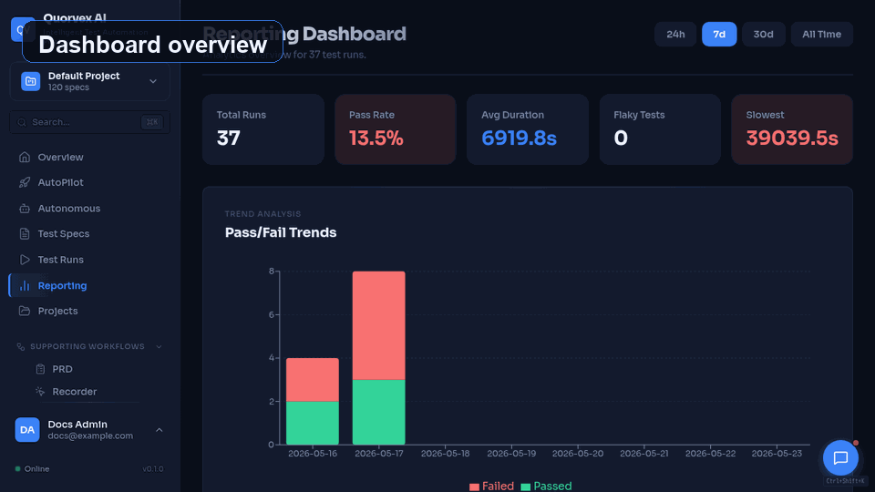

# Quorvex AI vs Shortest

Quorvex UI flow from dashboard to automated test generation.

## Overview

Both Quorvex AI and [Shortest](https://github.com/antiwork/shortest) use natural language and Playwright for test automation. The key difference is product shape: Shortest is a lightweight AI execution framework, while Quorvex AI is a dashboard-backed QA platform that generates owned tests, validates them, tracks coverage, and manages specialized testing workflows.

!!! note "Freshness"
    Last verified: 2026-05-23 against Shortest's public product page and repository-facing documentation. Re-check before publishing pricing-sensitive or competitor-sensitive copy.

## Feature Comparison

| Capability | Quorvex AI | Shortest |
|---------|-----------|----------|
| Natural-language authoring | Specs, PRDs, chat, exploration | Yes |
| Primary model | Generate, validate, and keep Playwright code | AI-powered execution framework |
| AI cost per test run | Zero for generated tests | AI execution is core |
| Web dashboard | Full QA dashboard | Not advertised as product surface |
| API testing | OpenAPI import, API specs, generated tests | Natural-language API tests |
| Database testing | Connections, schema checks, history | Callback code possible |
| Load testing | K6 scenarios, workers, run results | Not advertised |
| Security testing | ZAP/Nuclei scans and findings | Not advertised |
| LLM evaluation | Providers, datasets, comparisons | Not advertised |
| Requirements/RTM/coverage | Built in | Not advertised |
| PRD to tests | Upload, feature workspace, generated specs | Not advertised |
| Autonomous missions | Scheduled and approval-gated | Not advertised |
| CI/CD | GitHub/GitLab quality gates and PR advisor | Headless CI runs |
| Test management | TestRail, Jira | Not advertised |
| Self-hosted/open source | Yes, MIT | Yes, MIT |

## Key Differences

### Generate Once, Run Forever

Shortest documents AI-powered execution with Anthropic credentials. Quorvex AI uses AI to plan, generate, validate, and heal tests, then stores standard generated Playwright files so passing tests can run natively in CI.

### Multi-Domain Testing

Shortest now documents natural-language API tests and callback hooks. Quorvex AI goes further as an integrated QA platform: API specs, load scenarios, security scans, database checks, LLM evaluations, schedules, run history, and dashboards live in one product.

### Self-Healing Pipeline

When UI changes break tests, Quorvex AI's self-healing pipeline attempts repairs with native, hybrid, and standard modes, then records the result in run artifacts. Shortest's public documentation emphasizes AI execution rather than a dashboarded repair workflow.

### PRD to Tests

Quorvex AI can convert PRDs into a feature workspace, generated requirements, test specs, coverage views, and traceability. That makes product context part of the QA system instead of only a prompt to a runner.

## When to Choose Shortest

- You want a lightweight, CLI-only tool for simple UI tests
- You prefer AI interpretation at runtime for maximum flexibility
- You want a small package/repo workflow and do not need a dashboard, RTM, or specialized testing modules

## When to Choose Quorvex AI

- You need stable, reproducible test code for CI/CD pipelines
- You want a comprehensive QA platform (UI + API + load + security + database + LLM)
- AI token cost matters at scale
- You need self-healing, web dashboards, projects/RBAC, schedules, PR advisor, or test management integrations
- You want PRD, requirements, RTM, coverage, and autonomous testing workflows
