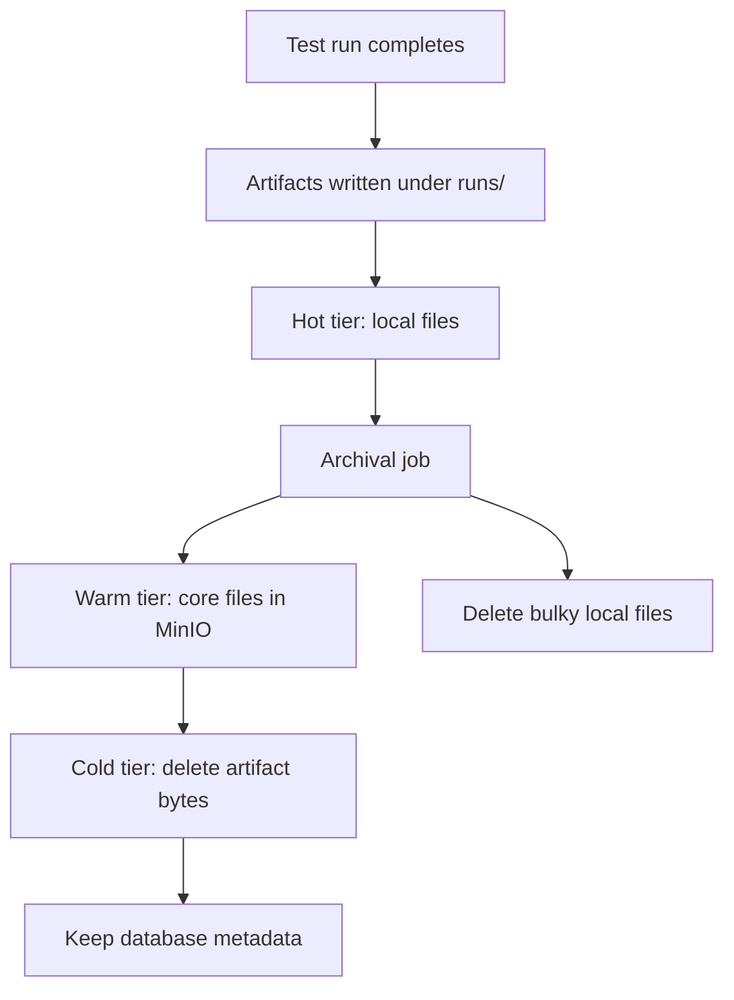

# Artifact Storage Lifecycle

Test runs dashboard showing generated artifacts and execution history.

How Quorvex AI stores, archives, monitors, and deletes test run artifacts.

## Why Artifact Storage Is Tiered

Generated tests produce useful but heavy artifacts: traces, screenshots, videos, reports, plan files, validation output, logs, and run metadata. Recent artifacts need fast local access for debugging. Older artifacts usually only need enough data for audit, trend analysis, or support.

Quorvex AI separates artifact metadata from artifact bytes. The database keeps run and artifact records; local storage and MinIO hold files according to retention age.

## Storage Tiers

| Tier | Default age | Location | Contents |
|------|-------------|----------|----------|
| Hot | 0-30 days | Local `runs/` directory | All artifacts |
| Warm | 30-90 days | MinIO artifacts bucket | Core artifacts such as plans, validation output, and reports |
| Cold | 90+ days | Database metadata only | Artifact files deleted |

The retention windows are controlled by `ARCHIVE_HOT_DAYS`, `ARCHIVE_TOTAL_DAYS`, and related archive settings.

## Core Components

| Component | Source | Responsibility |
|-----------|--------|----------------|
| Storage service | `orchestrator/services/storage.py` | MinIO connection, bucket operations, upload/download helpers |
| Archival service | `orchestrator/services/archival.py` | Retention policy, dry runs, archive jobs, local deletion |
| Health API | `orchestrator/api/health.py` | Database, local storage, MinIO, backup, Redis, alert checks |
| Artifact model | `RunArtifact` | Artifact path, storage type, size, archive time, expiry |
| Archive job model | `ArchiveJob` | One archival run and its processed/archive/delete counters |
| Storage stats model | `StorageStats` | Point-in-time storage health and size metrics |

## Archival Flow

The archival service finds completed runs older than the hot retention window, classifies artifacts, and applies the retention policy:

1. List local files for each eligible run.
2. Preserve core artifacts by uploading them to MinIO.
3. Create `RunArtifact` rows for archived objects.
4. Delete bulky artifacts that are not preserved in warm storage.
5. Find runs older than total retention and delete remaining artifact files.
6. Record an `ArchiveJob` summary with counts, bytes, errors, and configuration.

Use dry-run mode before changing retention or running archival manually.

## Health and Monitoring

`GET /health/storage` returns an aggregate health view:

| Area | Checks |
|------|--------|
| Database | connectivity, size, run counts |
| MinIO | connection, bucket existence, object counts, object sizes |
| Local storage | `runs/`, specs, tests, disk usage |
| Backups | latest backup presence and age |
| Redis | queue backend health when configured |
| Alerts | derived warnings for unhealthy dependencies or large storage |

`POST /health/storage/record` records a `StorageStats` snapshot for trend analysis.

## Operational Rules

- Treat local `runs/` as hot operational storage, not permanent archival.
- Keep MinIO credentials and buckets backed up with production configuration.
- Do not delete database run metadata when deleting old artifact bytes.
- Use `make archival-dry-run` before changing retention windows.
- Use `make storage-health` after backup, restore, or MinIO configuration changes.

## Related

- [Infrastructure & Deployment Design](infrastructure.md)
- [Deployment](../guides/deployment.md)
- [Disaster Recovery](../guides/disaster-recovery.md)
- [Runtime Observability and Recovery](../guides/runtime-observability-recovery.md)
- [Database Schema](../reference/database-schema.md)
