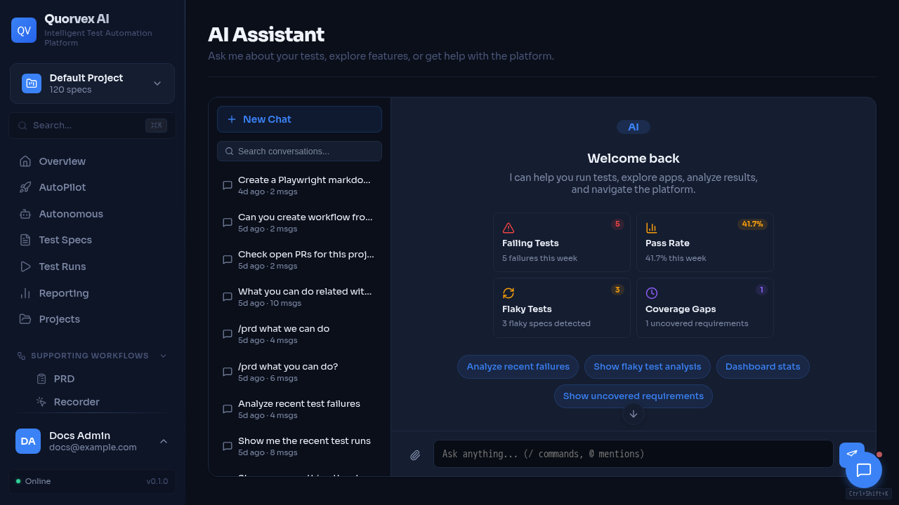
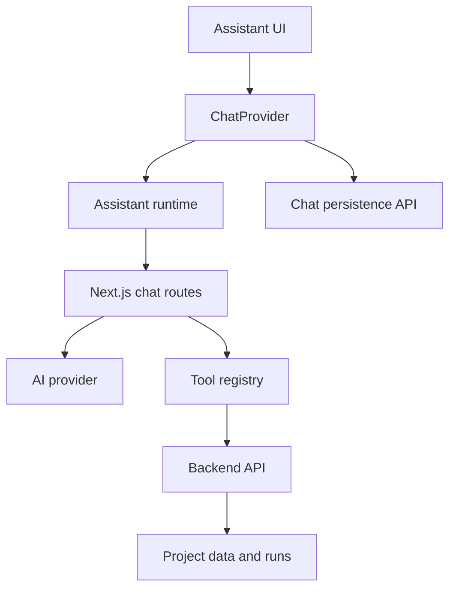

# Assistant Architecture

Assistant dashboard with project-aware chat and tool context.

How the dashboard assistant connects conversations, tools, approvals, and backend context.

## Why the Assistant Is a Subsystem

The assistant is not only a text box. It coordinates persisted conversations, streamed responses, project context, frontend tool calls, backend tool execution, and approval gates for actions that can mutate state or trigger expensive work.

The design keeps user-facing conversation state in the dashboard while delegating durable project data and operational actions to the backend.

## Main Components

| Component | Source | Responsibility |
|-----------|--------|----------------|
| `ChatProvider` | `web/src/components/assistant/ChatProvider.tsx` | Assistant runtime setup, UI message conversion, conversation lifecycle |
| Chat persistence client | `web/src/lib/chat-api.ts` | List, create, update, delete, search, and title conversations through backend endpoints |
| Assistant UI | `web/src/components/assistant/*` | Thread, message bubbles, conversation list, attachments |
| AI provider layer | `web/src/lib/ai/provider.ts` | Provider selection and model execution |
| Tool registry | `web/src/lib/ai/tools.ts` | Read and write actions exposed to the assistant |
| Backend client | `web/src/lib/ai/backend-client.ts` | Server-side calls from Next.js routes to FastAPI |
| Chat routes | `web/src/app/api/chat/*` | Streaming, tool execution, approval handling |

## Message Persistence

Conversation metadata and messages are persisted through backend `/chat` endpoints. The dashboard stores both readable content and structured message parts when needed.

`ChatProvider` converts between assistant UI message parts and AI SDK message parts. This matters for tool calls because tool invocation and tool result shapes differ between libraries.

## Tool Execution

Tools are grouped around product domains such as specs, runs, requirements, CI/CD, PR advisor, load testing, security testing, RTM, workflows, and AutoPilot.

Tool execution should follow these rules:

- read-only tools can fetch data directly through backend helpers
- mutating or costly tools should require approval
- tools should include project context when the backend endpoint is project-scoped
- tools should return structured data that the assistant can summarize
- tool errors should be explicit enough for the user to act on

## Approval Model

Some assistant actions can create specs, start runs, change CI settings, dispatch workflows, delete records, or open pull requests. Those actions should be marked as requiring approval in tool descriptions and execution routes.

Approval is a product safety boundary, not only a UI affordance. The assistant should prepare a clear action and wait for the user before the route performs the operation.

## Project Context

Assistant routes and tools should pass the selected project ID whenever possible. Project context lets the assistant answer with relevant specs, recent runs, failures, requirements, and integrations instead of global repository state.

When no project is selected, tools should use the same default project convention as the rest of the dashboard.

## Related

- [Frontend Architecture](frontend-architecture.md)
- [Dashboard Auth and Project Flow](dashboard-auth-project-flow.md)
- [Frontend API Routing](../reference/frontend-api-routing.md)
- [Memory System](memory-system.md)
- [API Endpoints](../reference/api-endpoints.md)
