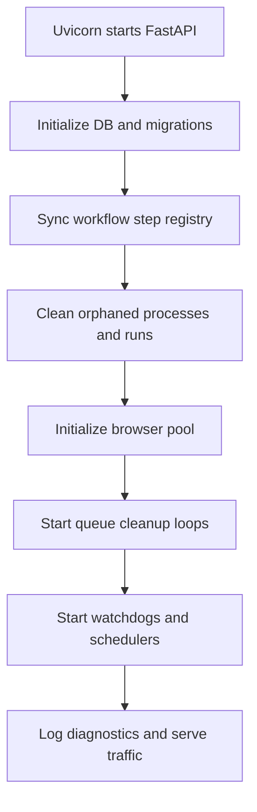

# Backend Runtime Lifecycle

Workflow monitor showing backend runtime execution state.

How the FastAPI backend starts, keeps itself healthy, and shuts down.

## Why Startup Is Stateful

Quorvex AI is exposed as a FastAPI application, but the backend is not only a request router. Startup prepares the durable runtime that later API calls depend on: database schema checks, workflow step metadata, process tracking, browser capacity, queue cleanup, scheduler reconciliation, and background maintenance loops.

The startup path is intentionally conservative. It cleans state left by previous processes before accepting normal traffic, because generated tests, browser sessions, K6 runs, and autonomous agents can outlive a single request.

## Startup Sequence

The main startup hook lives in `orchestrator/api/main.py`.

| Stage | Responsibility | Main source |
|-------|----------------|-------------|
| Logging reset | Reinitialize logging after Uvicorn and Alembic setup | `orchestrator/logging_config.py` |
| Database readiness | Create or migrate tables, detect legacy schema state, stamp known-good schema when needed | `orchestrator/api/db.py` |
| Workflow metadata | Sync built-in workflow step types into the database | `orchestrator/services/workflow_step_registry.py` |
| Process cleanup | Remove process records from previous server instances | `orchestrator/api/process_manager.py` |
| Run cleanup | Mark stuck queued or running test runs as stopped | `orchestrator/api/main.py` |
| Browser pool | Create the shared browser pool and free stale slots | `orchestrator/services/browser_pool.py` |
| Queue loops | Start cleanup loops for agent, K6, and distributed job queues | `orchestrator/services/*queue.py` |
| Scheduler | Initialize cron scheduling and reconcile missed workflow schedule executions | `orchestrator/services/scheduler.py` |
| Diagnostics | Log configuration and runtime capacity for early troubleshooting | `orchestrator/api/main.py` |

## Background Loops

Background tasks keep runtime state from drifting:

| Loop | Interval | Purpose |
|------|----------|---------|
| Queue watchdog | 60 seconds | Detect queued or running `TestRun` rows without backing in-process work |
| Browser pool cleanup | 10 minutes | Free stale browser slots and remove old completed slot records |
| Exploration cleanup | periodic | Mark stuck exploration sessions and release related browser capacity |
| Infrastructure maintenance | 15 minutes | Clean stale PID files, temp files, rate limiter entries, and scheduled execution state |
| Agent queue cleanup | 5 minutes | Clear orphaned or stale queued agent tasks |
| K6 queue cleanup | 5 minutes | Clear stale distributed load-test tasks |
| Job queue cleanup | 5 minutes | Clear stale distributed Playwright jobs |

The loops are defensive. API endpoints can also force some cleanup paths, but the periodic loops make recovery automatic after reloads, worker crashes, and interrupted local development sessions.

## Router Registration

Routers are registered in `orchestrator/api/main.py` before static artifact mounting and middleware setup. Domain routers own focused route groups such as auth, projects, memory, PRD processing, regression, exploration, requirements, CI/CD, specialized testing, chat, autonomous missions, and custom workflows.

The same module still owns legacy direct routes for core spec and run operations. New backend features should prefer a dedicated router module unless they are intentionally extending an existing direct route group.

## Shutdown Sequence

Shutdown performs the reverse cleanup:

1. Stop the cron scheduler.
2. Shut down tracked child processes.
3. Mark still-running database rows as stopped where appropriate.
4. Cancel background tasks.
5. Shut down the browser pool.

This keeps persisted state honest for the next startup. A run that was active during shutdown should not appear as actively executing after the process is gone.

## Operational Implications

- Startup can take longer than a plain FastAPI app because it reconciles durable state.
- A failed queue, scheduler, or browser cleanup loop should be treated as degraded runtime health, not only a log warning.
- Schema bootstrap logic exists for development and upgrade compatibility, but migrations remain the source of truth for production schema evolution.
- Process, queue, and browser cleanup should be idempotent because they may run at startup, by watchdog, and through manual endpoints.

## Related

- [System Architecture Overview](system-overview.md)
- [Queue and Worker Architecture](queue-worker-architecture.md)
- [Browser Pool and Concurrency](browser-pool.md)
- [Runtime Observability and Recovery](../guides/runtime-observability-recovery.md)
- [Database Schema](../reference/database-schema.md)
