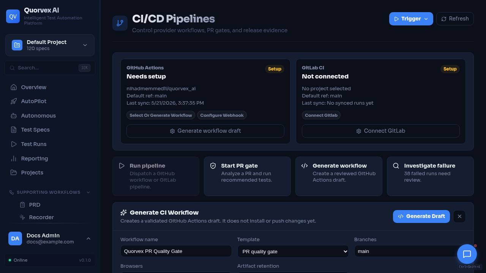
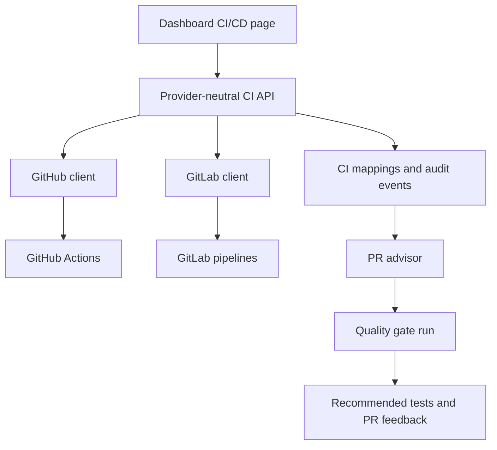

# CI/CD and PR Advisor Architecture

CI/CD dashboard with PR quality gates and pipeline context.

How Quorvex AI connects external CI providers, test selection, and pull request quality gates.

## Why CI Is Provider-Neutral

Quorvex AI supports GitHub Actions and GitLab CI while exposing a single dashboard model for workflows, runs, logs, artifacts, audit events, and dispatch actions. Provider-specific clients normalize external data into local database records so the dashboard and assistant can reason about CI without knowing every provider detail.

## Core Components

| Component | Source | Responsibility |
|-----------|--------|----------------|
| CI control API | `orchestrator/api/ci_control.py` | Provider-neutral providers, workflows, runs, dispatch, logs, workflow generation |
| GitHub API | `orchestrator/api/github_ci.py` | GitHub-specific configuration, webhooks, PR advisor, quality gates |
| GitLab API | `orchestrator/api/gitlab_ci.py` | GitLab-specific configuration and webhook support |
| GitHub client | `orchestrator/services/github_client.py` | GitHub REST operations |
| GitLab client | `orchestrator/services/gitlab_client.py` | GitLab REST operations |
| PR advisor | `orchestrator/services/pr_test_advisor.py` | Changed-file analysis, repo index, impacted test selection |
| Quality gate | `orchestrator/services/quality_gate.py` | PR quality gate state, run response, feedback finalization |

## Normalized CI Model

| Model | Purpose |
|-------|---------|
| `CiPipelineMapping` | Local record for external workflow or pipeline runs |
| `CiWorkflowChangeRequest` | Generated GitHub Actions workflow draft and validation state |
| `CiAuditEvent` | Audit trail for sync, dispatch, cancellation, rerun, and workflow generation |
| `CiTestSubset` | Saved subset of generated tests for CI execution |
| `PrImpactAnalysis` | PR advisor analysis result |
| `PrQualityGateRun` | Quality gate run status and final feedback state |
| `TestImpactMap` | Relationship between source changes and selected tests |
| `RepoIndexSnapshot` | Indexed repository state used for advisor analysis |

## CI Run Flow

1. Project settings store provider credentials and defaults.
2. The CI control API lists providers and available workflows.
3. A sync operation fetches recent GitHub workflow runs or GitLab pipelines.
4. External runs are normalized into `CiPipelineMapping` rows.
5. Dashboard run details fetch jobs, logs, and artifacts from the provider when requested.
6. Dispatch, cancel, and rerun actions call provider-specific APIs and create audit events.

## Workflow Generation

GitHub workflow generation creates a validated YAML draft before it is committed. The generator checks for common unsafe patterns such as pipe-to-shell commands, missing permissions, `write-all`, and secret echoing.

When GitHub repository write access is configured, Quorvex AI can open a draft pull request for the generated workflow. Otherwise, the user copies the generated YAML into the repository.

## PR Advisor and Quality Gates

The PR advisor analyzes changed files and recommends relevant generated tests. A quality gate can then:

- analyze a configured pull request
- optionally run recommended tests as a regression batch
- monitor CI and Quorvex test status
- publish final feedback to the pull request when configured

Quality gates are intentionally approval-oriented because they can trigger CI, run tests, and publish external feedback.

## Security Boundaries

- Provider tokens are stored in project integration settings and encrypted where implemented.
- Webhook secrets should be configured for externally reachable deployments.
- Generated workflows must use repository secrets for target URLs and Quorvex API tokens.
- Dispatch and pull request creation should be treated as mutating actions.

## Related

- [Integrations](../guides/integrations.md)
- [CI/CD Setup](../tutorials/ci-cd-setup.md)
- [Integration Contracts](../reference/integration-contracts.md)
- [Credential Management](../guides/credential-management.md)
- [Security Model](security-model.md)
