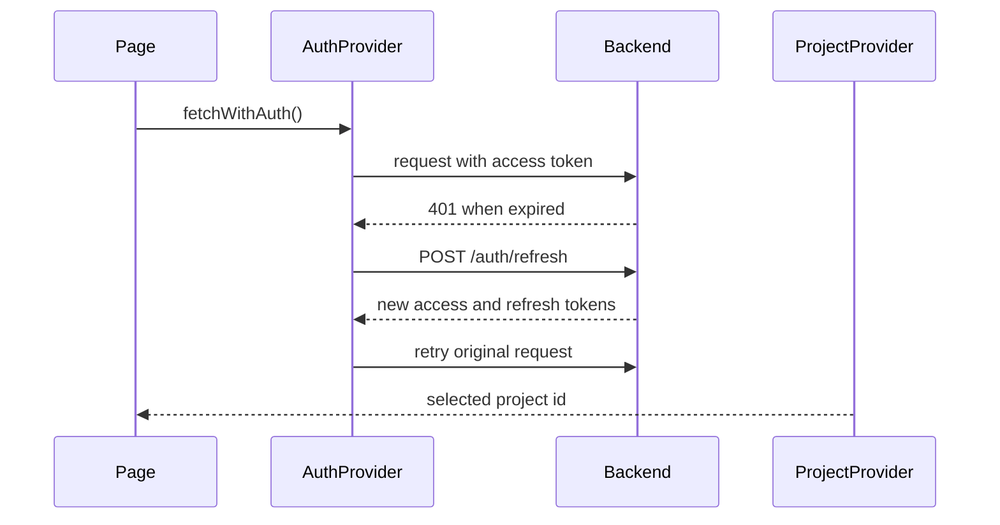

# Dashboard Auth and Project Flow

Projects dashboard for authenticated project selection and membership.

How dashboard authentication, token refresh, and project selection work together.

## Why Auth State Is Split

The dashboard keeps the access token in memory and the refresh token in `localStorage`. This reduces persistent exposure of the short-lived access token while still allowing page reloads to restore a session.

Project selection is managed separately because project context is not the same as user identity. A user can stay logged in while switching the project used by specs, runs, requirements, credentials, schedules, and dashboard data.

## Auth Runtime

`web/src/contexts/AuthContext.tsx` owns the browser auth runtime:

| Concern | Behavior |
|---------|----------|
| Access token | Stored in module memory, not `localStorage` |
| Refresh token | Stored in `localStorage` as `refresh_token` |
| Refresh timing | Scheduled before the expected access-token expiry |
| Refresh races | A shared refresh promise prevents concurrent refresh attempts |
| Authenticated requests | `fetchWithAuth` retries once after a successful refresh |
| Logout | Calls `/auth/logout` when possible, clears local refresh token and in-memory access token |

Feature code should use `fetchWithAuth` for backend requests that may require auth. It should not read or write tokens directly.

## Project Runtime

`web/src/contexts/ProjectContext.tsx` owns selected project state. Pages should use the project context or project-aware helpers instead of inventing page-local project storage.

Project-scoped API requests should include the selected project ID in the way the backend endpoint expects, usually as `project_id` query parameter or path segment. New pages should follow nearby feature pages rather than creating a new convention.

## Provider Ordering

The dashboard shell should keep auth and project providers outside feature pages. Feature components can then assume:

- auth state is loaded before protected content renders
- project state is available through a hook
- API helpers can attach auth headers consistently
- redirect behavior stays centralized in auth components

## Failure Modes

| Failure | Expected handling |
|---------|-------------------|
| Missing refresh token on mount | Treat the user as logged out |
| Refresh request fails | Clear refresh token and require login |
| Backend returns 401 | Attempt one refresh, then return the failed response if refresh fails |
| Project is missing | Fall back to the default project or show project selection depending on the page |
| User lacks project role | Let backend authorization decide and surface the error in the page |

## Security Notes

- Do not persist access tokens in page state, query strings, or logs.
- Do not send refresh tokens to frontend API routes unless the route is explicitly part of auth.
- Do not duplicate token refresh logic in feature pages.
- Prefer backend permission checks over frontend-only hiding of controls.

## Related

- [Security Model](security-model.md)
- [Frontend Architecture](frontend-architecture.md)
- [Frontend API Routing](../reference/frontend-api-routing.md)
- [Authentication & RBAC](../guides/authentication.md)
- [Credential Management](../guides/credential-management.md)
