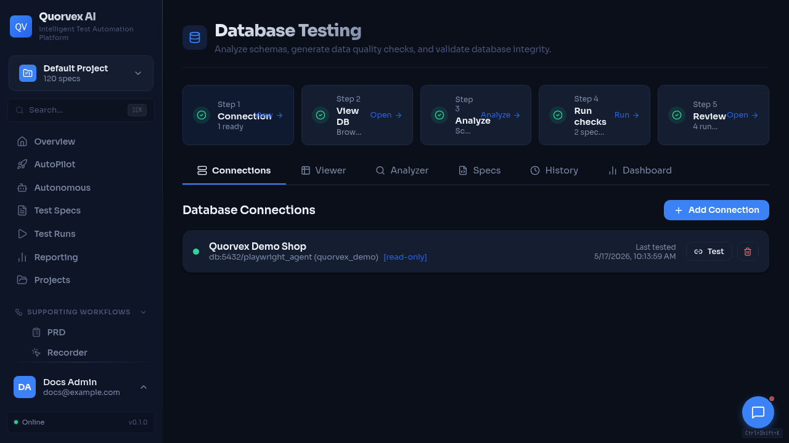
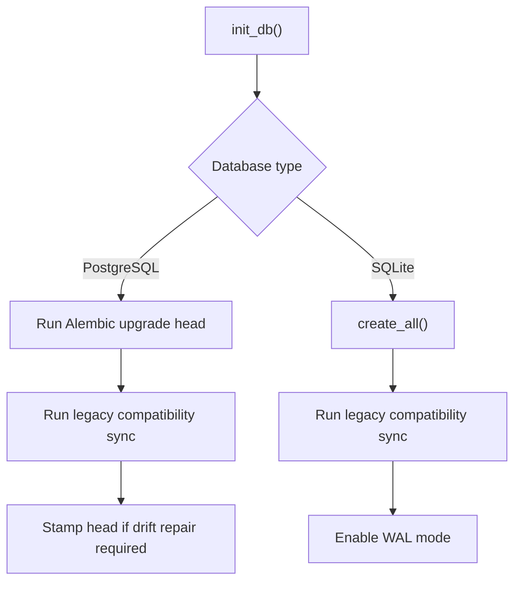

# Database Migration Architecture

Database testing dashboard used to validate schema changes.

How Quorvex AI manages schema evolution across SQLite development databases and PostgreSQL deployments.

## Why There Are Two Paths

Quorvex AI supports SQLite for local development and PostgreSQL for production. SQLite keeps initial setup simple, but PostgreSQL is required for production concurrency and parallel execution. Schema management therefore has two paths:

- PostgreSQL uses Alembic migrations.
- SQLite uses `SQLModel.metadata.create_all()` plus legacy compatibility migrations.

## Source of Truth

| Source | Purpose |
|--------|---------|
| `orchestrator/api/models_db.py` | SQLModel model definitions |
| `orchestrator/migrations/versions/` | Alembic migration revisions |
| `orchestrator/migrations/env.py` | Alembic environment and metadata import |
| `alembic.ini` | Alembic script location and logging configuration |
| `orchestrator/api/db.py` | Engine setup, startup migration orchestration, SQLite compatibility path |

## PostgreSQL Startup Behavior

For PostgreSQL, `init_db()` attempts to run Alembic migrations to head. It also handles older databases that existed before Alembic was introduced:

| Case | Behavior |
|------|----------|
| Fresh database | Run all migrations from scratch |
| Existing database without `alembic_version` | Stamp baseline revision, then allow future migrations |
| Legacy drift detected | Run compatibility sync, then stamp head when safe |
| Alembic failure | Fall back to `create_all()` and legacy sync for compatibility |

The fallback keeps development and older deployments usable, but production schema changes should still be expressed as Alembic migrations.

## SQLite Startup Behavior

SQLite is for development and lightweight demos. It uses:

- table creation through SQLModel metadata
- legacy column/table synchronization in `db.py`
- WAL mode for better concurrent read behavior

Production environments should set `DATABASE_URL` to PostgreSQL. The runtime warns when SQLite is used with parallel browser settings.

## Migration Commands

| Command | Purpose |
|---------|---------|
| `make db-migrate M="description"` | Generate an Alembic revision from model changes |
| `make db-upgrade` | Apply pending migrations |
| `make db-downgrade` | Roll back one migration |
| `make db-history` | Show migration history |
| `make db-stamp R=001` | Mark an existing database at a revision without running that migration |
| `make db-vacuum` | Run PostgreSQL maintenance |

## Contributor Rules

- Add or update SQLModel definitions first.
- Generate an Alembic migration for PostgreSQL-visible schema changes.
- Review autogenerated migrations before committing.
- Include indexes and data backfills explicitly when needed.
- Update `docs/reference/database-schema.md` for public model changes.
- Test startup on the intended database path when changing bootstrap logic.

## Recovery Rules

- Use backup restore for data recovery.
- Use Alembic migrations for schema-only recovery on a fresh PostgreSQL database.
- Preserve `JWT_SECRET_KEY` when restoring encrypted credentials.
- Use `db-stamp` only when the schema already matches the revision being stamped.

## Related

- [Database Schema](../reference/database-schema.md)
- [Deployment](../guides/deployment.md)
- [Disaster Recovery](../guides/disaster-recovery.md)
- [Backend Runtime Lifecycle](backend-runtime-lifecycle.md)
- [Runtime Observability and Recovery](../guides/runtime-observability-recovery.md)
