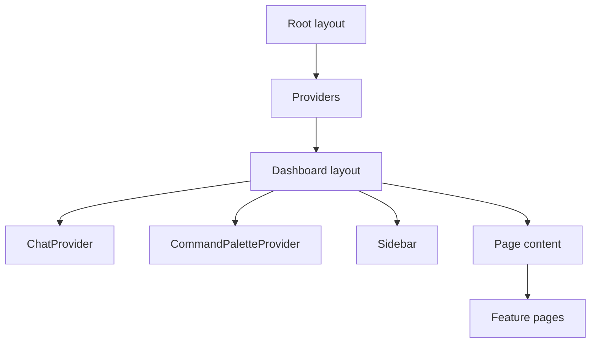

# Frontend Architecture

Quorvex dashboard overview showing frontend layout and navigation.

How the Next.js dashboard shell composes pages, providers, navigation, and shared UI behavior.

## Why the Dashboard Uses a Shell

The dashboard is a dense operational surface. Most pages need the same runtime context: authentication, selected project, command palette, assistant state, sidebar navigation, notifications, and responsive layout. The app shell centralizes these concerns so individual pages can focus on feature data and workflows.

## Route Groups

The dashboard uses Next.js App Router route groups:

| Area | Path pattern | Purpose |
|------|--------------|---------|
| Auth | `web/src/app/(auth)/` | Login and registration pages |
| Dashboard | `web/src/app/(dashboard)/` | Authenticated product pages |
| API routes | `web/src/app/api/` | Next.js server routes for assistant and tool execution |
| Backend proxy | `web/src/app/backend-proxy/[...path]/route.ts` | Proxy browser requests to the backend in deployed environments |

Route groups do not appear in URLs. A page under `web/src/app/(dashboard)/memory/page.tsx` is served at `/memory`.

## Provider Responsibilities

| Provider or shell component | Main source | Responsibility |
|-----------------------------|-------------|----------------|
| `Providers` | `web/src/components/Providers.tsx` | Root client providers for global dashboard behavior |
| `AuthProvider` | `web/src/contexts/AuthContext.tsx` | Access token state, refresh token flow, authenticated fetch helper |
| `ProjectProvider` | `web/src/contexts/ProjectContext.tsx` | Selected project and project-scoped state |
| `ChatProvider` | `web/src/components/assistant/ChatProvider.tsx` | Assistant runtime, conversation state, message conversion |
| `CommandPaletteProvider` | `web/src/components/command-palette/CommandPaletteProvider.tsx` | Keyboard command search and execution |
| `Sidebar` | `web/src/components/Sidebar.tsx` | Grouped navigation and route highlighting |

Provider order matters when a child provider or component needs auth or project context. Feature pages should use existing hooks instead of creating parallel local state for these concerns.

## Navigation Model

Sidebar navigation is defined in `web/src/components/Sidebar.tsx`. Command palette navigation is defined separately in `web/src/components/command-palette/command-data.ts`.

When adding a dashboard page, keep both surfaces aligned:

- route file under `web/src/app/(dashboard)/`
- sidebar entry in the appropriate group
- command palette entry with useful keywords
- documentation entry in `docs/reference/web-dashboard.md` when the page is public

## Page Composition

Feature pages should prefer shared primitives for consistent behavior:

- `PageLayout` for common spacing and width
- `PageHeader` for title, description, and actions
- `ListPageSkeleton`, `GridPageSkeleton`, or `DashboardPageSkeleton` during loading
- `EmptyState` when a filtered or new project has no data
- `StatusBadge` and `SeverityBadge` for normalized status colors
- shared `Button`, `Input`, `Dialog`, `Table`, `Tabs`, and `Select` components

Local page components are appropriate when the component is tightly bound to one domain. Shared components belong under `web/src/components/ui/` or `web/src/components/shared/` only when multiple pages need the same contract.

## Server and Browser Boundaries

Most dashboard pages are client components because they use auth context, project context, polling, or browser-local interaction. Server routes under `web/src/app/api/` should handle server-only assistant/provider work and call the backend through `web/src/lib/ai/backend-client.ts`.

Browser requests should use `API_BASE` from `web/src/lib/api.ts`; server routes should use `INTERNAL_API_URL` through backend client helpers.

## Related

- [Frontend API Routing](../reference/frontend-api-routing.md)
- [Dashboard Auth and Project Flow](dashboard-auth-project-flow.md)
- [Assistant Architecture](assistant-architecture.md)
- [Adding a Dashboard Feature](../guides/adding-dashboard-feature.md)
- [Web Dashboard](../reference/web-dashboard.md)
