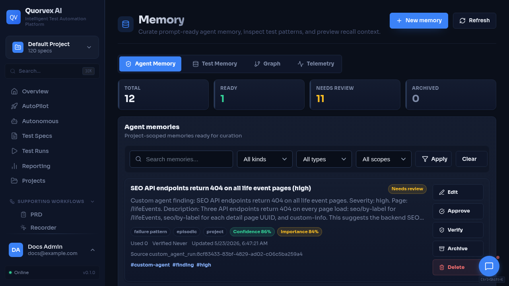
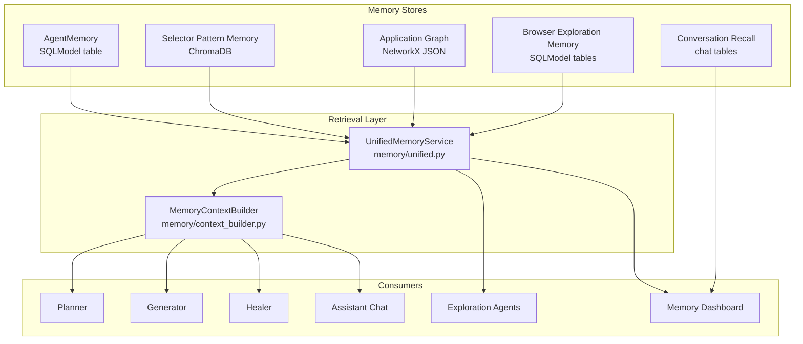

# Memory System



<p class="caption">Memory dashboard showing reusable context and coverage signals.</p>


The memory system lets Quorvex AI reuse what it has already learned about an application, a project, and prior agent work. It stores reliable selectors, discovered browser states, coverage gaps, curated agent memories, and prompt-injection telemetry, then returns a bounded context bundle to planners, generators, healers, chat, and exploration agents.

Memory is advisory. Live browser observations, the current spec, and explicit user instructions always outrank stored memory.

## Why Memory Exists

Without memory, each test generation starts cold. The planner must rediscover application structure, the generator must guess selectors again, and the healer has no durable record of failures that already happened.

Memory solves four recurring problems:

1. **Selector reuse**: proven Playwright selectors can be suggested before the generator falls back to trial and error.
2. **Exploration continuity**: discovered pages, elements, flows, and frontier work survive beyond one exploration session.
3. **Agent context**: durable project facts, user preferences, workflow decisions, failure patterns, and agent lessons can be injected into future prompts.
4. **Auditability**: prompt context injection is recorded so maintainers can inspect which memories influenced a run.

## Architecture



`UnifiedMemoryService` builds one typed bundle from the available stores. `MemoryContextBuilder` formats the most relevant parts of that bundle for prompt injection.

## Store Types

| Store | Backing technology | Main data | Primary readers |
|-------|--------------------|-----------|-----------------|
| Agent memory | SQLModel database plus optional vector index | Curated facts, preferences, decisions, failure patterns, lessons | Chat, planner, generator, healer, dashboard |
| Memory knowledge graph | SQLModel database | Typed relationships between memories, topics, pages, workflows, failures, and selectors | Unified context, telemetry, dashboard |
| Selector pattern memory | ChromaDB collections | Successful action, target, selector, duration, success rate | Planner, generator, coverage APIs |
| Application graph | NetworkX graph persisted as JSON | Pages, elements, flows, navigation edges, tested counts | Coverage APIs, planner, exploration views |
| Browser exploration memory | SQLModel database | Canonical browser states, stable elements, ranked frontier work | Exploration agents, dashboard, unified context |
| Conversation recall | SQLModel chat tables | Recent or searched assistant messages with context windows | Dashboard and assistant recall flows |
| Injection telemetry | SQLModel database | Memory IDs, prompt stage, query, context preview, outcome | Dashboard, debugging, audit reviews |

## Agent Memory

Agent memory is the curated working memory used by assistants and autonomous agents. It is stored in the `agent_memories` table and indexed into the vector store when possible.

Valid memory kinds:

| Kind | Default type | Use |
|------|--------------|-----|
| `project_fact` | `semantic` | Stable facts about the product, app, environment, or test target |
| `user_preference` | `semantic` | Preferences that should guide future agent behavior |
| `workflow_decision` | `procedural` | Process choices, conventions, or accepted ways of working |
| `failure_pattern` | `episodic` | Recurring failures and their observed causes |
| `agent_lesson` | `procedural` | Lessons that should change future agent behavior |

Valid memory types are `semantic`, `episodic`, `procedural`, and `structural`. Valid scopes are `global`, `project`, `user`, and `agent`.

Agent memories include confidence, importance, tags, source metadata, optional validity windows, review status, verification timestamps, and use counts. Review-required memories are excluded from prompt injection until approved.

## Memory Knowledge Graph

The memory knowledge graph is a derived SQL-backed graph over approved agent memories. Each saved memory becomes a `memory` node, and the graph links it to typed entities such as topics, pages, workflows, failures, and selector evidence.

The graph is used after normal vector/SQL retrieval. Primary retrieval finds the most relevant memories, then graph expansion adds closely connected memories with explanations such as shared topic, observed page, failure cause, fix, or supersession. Graph-expanded memories remain advisory and are excluded when they are review-required, archived, deleted, or otherwise inactive.

Graph APIs expose project-scoped graph summaries, per-memory neighborhoods, and a rebuild operation for regenerating relationships from existing approved memories.

## Safety Model

Agent memory is screened before it can be stored or injected:

- Secret-looking values are redacted.
- Prompt-injection phrases and role-hijack patterns are rejected.
- Invisible Unicode control characters are rejected.
- Empty or fully redacted memories are dropped.
- Review-required memories stay out of prompt context until approved.
- Validity windows and status filters prevent expired, archived, deleted, or superseded memories from being selected.

This is a guardrail, not a substitute for human review. Memories that came from noisy agent output should normally be marked `review_required`.

## Consolidation

`MemoryConsolidationService` turns a larger text block, such as a chat transcript or agent report, into a small set of durable memory candidates.

By default, consolidation is deterministic and uses local heuristics. Optional LLM extraction only runs when the caller sets `use_llm=true`, `OPENAI_API_KEY` is available, and `MEMORY_CONSOLIDATION_LLM=true`.

The consolidation prompt asks for zero to five high-signal memories and rejects one-off chatter, credentials, and private data.

## Selector Pattern Memory

Selector pattern memory stores successful test actions as vector-searchable records. A typical record contains:

```python
{
    "action": "click",
    "target": "Submit button",
    "selector_type": "role",
    "selector_value": "button[name='Submit']",
    "playwright_selector": "page.getByRole('button', { name: 'Submit' })",
    "success_count": 42,
    "failure_count": 3,
    "success_rate": 0.93,
    "avg_duration": 250,
    "page_url": "https://example.com/login",
}
```

When a future spec mentions a similar target, the planner or generator can request selector hints with a minimum success rate. The generated code still verifies selectors against the live browser.

## Browser Exploration Memory

Browser exploration memory stores canonical states and ranked frontier work for continuous discovery.

It tracks:

- states, such as normalized URLs, state keys, source fidelity, visit counts, and timestamps;
- elements, such as role, name, durable locators, test counts, success and failure counts, stability, and importance;
- frontier items, such as action type, risk level, lease status, attempts, rank score, and priority score.

Frontier APIs let exploration workers claim, complete, fail, or skip work with leases. This keeps long-running or recurring exploration from repeatedly testing the same low-value path.

## Unified Context Bundle

`UnifiedMemoryService.build_bundle()` returns a structured object with:

- `agent_memories`: semantic, episodic, and procedural memory sections;
- `browser_memory`: states, elements, and frontier items;
- `graph_context`: graph stats, flows, coverage gaps, and navigation paths when URLs are present in the query;
- `selector_patterns`: similar successful selector records;
- `coverage_gaps`: high-priority untested elements or flows.

`MemoryContextBuilder.format_prompt_context()` converts this bundle into a compact prompt section with provenance labels and guidance that stored memory is advisory.

## Injection Telemetry

When generator and healer stages inject memory context, `record_memory_injection()` writes a `memory_injection_events` row with:

- project ID;
- actor type and stage;
- source type and source ID;
- retrieval query;
- selected memory IDs;
- context preview;
- outcome and extra metadata.

Use this telemetry to debug why a prompt included certain facts, confirm whether memory was active for a run, and identify stale memories that need review.

## Configuration

| Variable | Default | Purpose |
|----------|---------|---------|
| `MEMORY_ENABLED` | `true` | Enables memory retrieval and storage |
| `MEMORY_PROJECT_ID` | unset | Project ID injected into pipeline subprocesses |
| `CHROMADB_PERSIST_DIRECTORY` | `./data/chromadb` | ChromaDB vector store location |
| `MEMORY_COLLECTION_PREFIX` | `test_automation` | Prefix for ChromaDB collection names |
| `EMBEDDING_MODEL` | `text-embedding-3-small` | Embedding model for semantic retrieval |
| `EMBEDDING_DIMENSION` | `1536` | Expected embedding vector size |
| `MEMORY_RETENTION_DAYS` | `365` | Retention horizon for memory records |
| `MEMORY_CONSOLIDATION_LLM` | unset | Enables optional LLM consolidation when set to `true` |
| `MEMORY_CONSOLIDATION_MODEL` | `OPENAI_MODEL_ID` or `gpt-4o-mini` | Model used for optional LLM consolidation |
| `COVERAGE_ENABLED` | `true` | Enables coverage analysis from memory |
| `COVERAGE_THRESHOLD` | `0.8` | Target coverage threshold |

!!! note "Memory without OpenAI"
    If `OPENAI_API_KEY` is not set, selector and agent memory can still function with the available local/default embedding path, but semantic retrieval quality may be lower. Graph, browser exploration, and SQL-backed agent memory records do not require OpenAI.

## Related

- [Web Dashboard](../reference/web-dashboard.md) -- Memory page capabilities
- [API Endpoints](../reference/api-endpoints.md#memory) -- Memory REST API reference
- [Environment Variables](../reference/environment-variables.md#memory-system) -- Runtime configuration
- [Pipeline Architecture](pipeline-architecture.md) -- Where planner, generator, and healer use memory
