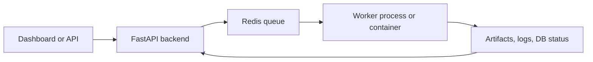

# Queue and Worker Architecture

Workflow monitor showing queued work and runtime diagnostics.

How Quorvex AI distributes long-running work across Redis-backed queues and workers.

## Why Queues Exist

The backend handles many operations that should not be bound to one HTTP request: autonomous agent tasks, distributed Playwright execution, and K6 load tests. Redis-backed queues provide durable handoff between the API process and worker processes or containers.

Queueing also gives operators clearer control over capacity. The API can accept work, expose status, and return quickly while workers consume tasks according to available browser, CPU, network, and K6 capacity.

## Queue Types

| Queue | Main source | Worker | Primary use |
|-------|-------------|--------|-------------|
| Agent queue | `orchestrator/services/agent_queue.py` | `orchestrator/services/agent_worker.py` | Autonomous and assistant-style agent tasks that call the CLI runtime |
| Job queue | `orchestrator/services/job_queue.py` | Browser worker containers | Distributed Playwright test execution |
| K6 queue | `orchestrator/services/k6_queue.py` | `orchestrator/services/k6_worker.py` | Distributed load-test execution with log streaming and cancellation |

Each queue tracks queued, running, and terminal states separately from the database records that initiated the work. The database remains the user-facing record of runs, missions, and jobs; Redis coordinates live execution.

## Agent Queue

The agent queue is enabled when Redis is configured and `USE_AGENT_QUEUE` is not disabled. Agent workers poll Redis, execute CLI-backed agent tasks, stream progress through heartbeats, and submit results.

Important behaviors:

- worker heartbeat records identify live workers
- task heartbeats carry progress snapshots
- cancellation uses Redis flags that workers monitor cooperatively
- pause and resume can suspend and continue the active CLI process group
- startup cleanup marks previous running tasks as failed because their worker process is gone
- stale task cleanup handles missing owners, missing queue entries, and long-running tasks

This queue is used by autonomous mission work items and any flow that needs isolated agent execution outside the API process.

## Distributed Playwright Job Queue

The job queue is a Redis priority queue for browser worker containers. The API enqueues test jobs with execution configuration. Workers atomically dequeue jobs, update status, and submit results.

The queue keeps metrics for pending, running, enqueued, dequeued, completed, failed, timeout, and cancelled work. Cleanup marks jobs as timed out when workers disappear or a running job exceeds the configured age.

This queue is separate from the browser pool. The job queue distributes work to worker processes; the browser pool limits and tracks browser slots inside a backend or worker runtime.

## K6 Queue

The K6 queue uses a FIFO Redis list and task/result hashes for load-test work. It also stores:

- cancel keys by run ID
- Redis log lists for real-time log viewing
- task heartbeats
- worker heartbeats
- segment mappings for distributed load-test runs

K6 workers launch the K6 process, stream log lines to Redis, monitor cancellation, and persist final results back through the queue and database.

## Cleanup and Recovery

Queues assume that workers can crash, containers can restart, and local development servers can reload. Cleanup paths therefore run in multiple places:

| Cleanup path | Trigger | Result |
|--------------|---------|--------|
| Startup cleanup | Backend starts | Previous running tasks are marked terminal because old workers are gone |
| Periodic cleanup loop | Every few minutes | Stale or orphaned queue entries are failed, timed out, or cancelled |
| Manual cleanup endpoint | Operator action | Queue-specific orphan cleanup can be forced |
| Worker graceful shutdown | SIGINT or SIGTERM | Current process receives termination and the queue connection is closed |

## Scaling Model

- Scale API processes carefully because direct in-process run state is still used for some legacy execution paths.
- Scale agent workers horizontally when autonomous or agent task throughput is the bottleneck.
- Scale K6 workers separately from browser workers because K6 has different CPU and network characteristics.
- Use queue depth, running count, worker heartbeat age, and task age as the main autoscaling signals.

## Related

- [Backend Runtime Lifecycle](backend-runtime-lifecycle.md)
- [Infrastructure & Deployment Design](infrastructure.md)
- [Browser Pool and Concurrency](browser-pool.md)
- [Runtime Observability and Recovery](../guides/runtime-observability-recovery.md)
- [Makefile Commands](../reference/makefile.md)
