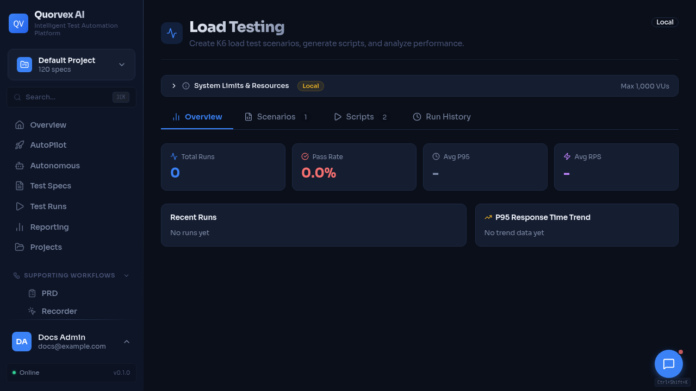
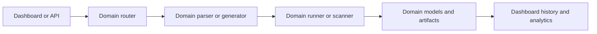

# Specialized Testing Architecture

Specialized testing dashboard for load, security, database, and LLM workflows.

How non-UI testing domains plug into the Quorvex AI platform.

## Why Specialized Pipelines Exist

The core Playwright UI pipeline is not the right execution model for every quality signal. API, load, security, database, mobile, and LLM testing each need different inputs, execution engines, status models, and artifacts.

Quorvex AI keeps these domains in separate API routers and workflow modules while reusing common platform concepts: project scoping, specs, generated artifacts, run history, dashboard pages, credentials, scheduling, and AI-assisted generation.

## Domain Map

| Domain | Router | Engine |
|--------|--------|--------|
| API testing | `api_testing.py` | Playwright `request` fixture |
| Load testing | `load_testing.py` | K6 |
| Security testing | `security_testing.py` | Python checks, Nuclei, OWASP ZAP |
| Database testing | `database_testing.py` | SQL checks and schema analysis |
| LLM testing | `llm_testing.py` | Provider API calls and scoring |
| Mobile testing | `mobile_appium.py` | Appium/WebdriverIO |

Core services stay in `orchestrator/services/` or `orchestrator/workflows/`. Important examples include `openapi_processor.py`, `native_api_generator.py`, `load_test_runner.py`, `nuclei_runner.py`, `db_schema_analyzer.py`, and `llm_evaluator.py`.

## Shared Patterns

| Pattern | How it appears |
|---------|----------------|
| Project scoping | Most routers filter specs, runs, credentials, and analytics by project |
| Generated specs | Domains can turn imported or analyzed inputs into markdown specs |
| Generated code | API, load, and mobile flows produce executable test code or scripts |
| Async jobs | Long-running generation, scanning, or execution returns job/run IDs |
| Run history | Domain-specific models preserve status, metrics, and artifacts |
| AI assistance | Generators and analyzers use AgentRunner or provider-specific evaluators |
| Credentials | Sensitive provider, app, database, and integration credentials are encrypted or referenced through settings |

## Domain Differences

| Domain | Key difference from UI pipeline |
|--------|---------------------------------|
| API testing | No browser required; generated tests use Playwright API requests |
| Load testing | K6 can consume target resources heavily, so browser operations are locked during active load tests |
| Security testing | Scanners can be passive, quick, template-based, or active DAST; findings need deduplication and triage |
| Database testing | Requires direct database connectivity and read/write permissions depending on checks |
| LLM testing | Measures quality, cost, latency, and regression across providers and datasets |
| Mobile testing | Requires Appium configuration and device/simulator availability |

## Data and Artifact Boundaries

Specialized domains should not overload `TestRun` when they need domain-specific metrics. They use domain models such as `LoadTestRun`, `SecurityScanRun`, `DbTestRun`, `LlmTestRun`, and related result tables.

Use shared run artifacts when the output is a normal test artifact. Use domain tables when the output has domain-specific analytics, trends, or comparison behavior.

## Extension Rules

- Add a dedicated router for a new testing domain.
- Keep domain generation and execution in `orchestrator/workflows/` or `orchestrator/services/`.
- Add domain-specific models when the dashboard needs history, comparison, analytics, or triage.
- Document the domain in API endpoints, dashboard reference, environment variables, and a how-to guide.
- Avoid adding browser pool dependencies unless the domain actually needs a browser.

## Related

- [API Testing](../guides/api-testing.md)
- [Load Testing](../guides/load-testing.md)
- [Security Testing](../guides/security-testing.md)
- [Database Testing](../guides/database-testing.md)
- [LLM Evaluation](../guides/llm-testing.md)
- [Mobile Testing](../guides/mobile-testing.md)
- [Pipeline Architecture](pipeline-architecture.md)
