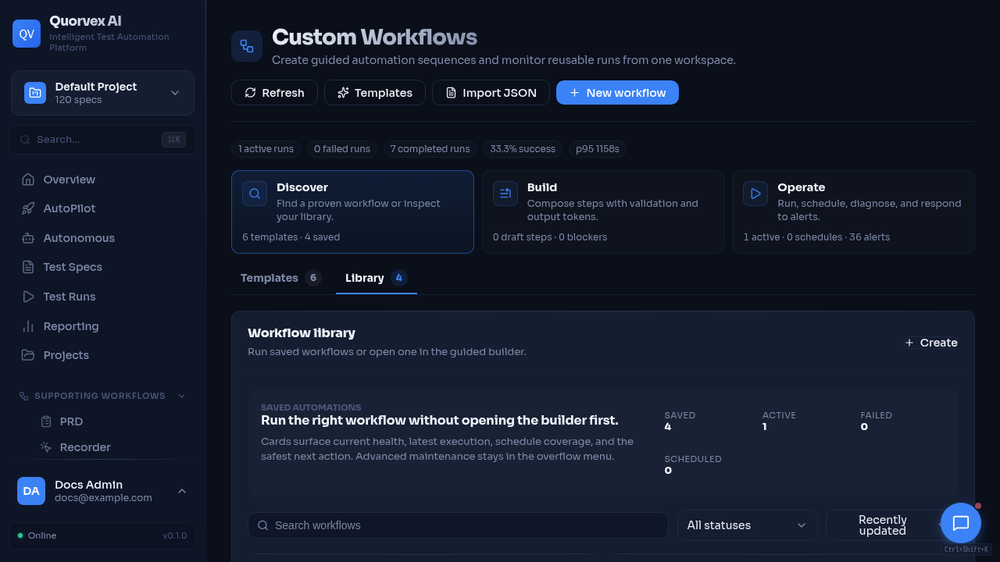
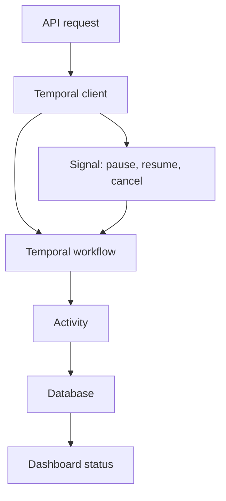

# Temporal Orchestration

Workflow monitor showing orchestration and workflow diagnostics.

How durable Temporal workflows coordinate autonomous missions and custom workflows.

## Why Temporal Is Used

Autonomous missions and custom workflows need durable control flow: pause, resume, cancellation, retries, status recovery, and long gaps between iterations. Temporal stores workflow history and lets the backend reconnect to workflow state after process restarts.

The database remains the product record. Temporal is the durable execution engine. API handlers start and signal Temporal workflows, while activities read and update database rows.

## Workflow Families

| Workflow | Source | Task queue | Purpose |
|----------|--------|------------|---------|
| `AutonomousMissionWorkflow` | `orchestrator/workflows/autonomous_mission_workflow.py` | `settings.temporal_task_queue` | Long-lived mission iterations, approvals, budget checks, and next-run delay |
| `CustomWorkflowRun` | `orchestrator/workflows/custom_workflow_temporal.py` | `settings.temporal_workflow_task_queue` | Durable execution of saved workflow definitions and persisted run steps |

Temporal client helpers live in `orchestrator/services/temporal_client.py`. They create workflow IDs, start workflows, send control signals, and fetch lightweight diagnostics.

## Autonomous Missions

An autonomous mission workflow loops until cancelled or completed. Each iteration:

1. Updates mission heartbeat.
2. Loads current mission policy from the database.
3. Pauses when budget or approval limits require human review.
4. Creates a mission run row.
5. Executes one bounded iteration through activities.
6. Completes or fails the mission run.
7. Computes the next delay and sleeps or continues as new.

The workflow supports `pause`, `resume`, and `cancel` signals. Activities in `orchestrator/services/autonomous_activities.py` own database writes, agent work item synchronization, finding creation, and proposal creation.

## Custom Workflows

A custom workflow run wraps persisted workflow steps. The Temporal workflow repeatedly asks the workflow runner for the next step, executes it as an activity, and applies recovery semantics when a step fails.

Control signals:

| Signal | Effect |
|--------|--------|
| `pause` | Sets workflow state to paused and persists the pause reason |
| `resume` | Lets the workflow continue to the next step |
| `cancel` | Marks the run cancelled and stops further step execution |

Step execution remains in `orchestrator/services/workflow_runner.py`. Temporal provides durability around that runner rather than replacing its validation and persistence model.

## Activity Boundaries

Activities are the only place where workflow code should perform non-deterministic operations such as database I/O, subprocess execution, API calls, or queue operations. Workflow code should make deterministic decisions from activity results and signals.

This boundary matters because Temporal can replay workflow history. If non-deterministic work leaks into workflow methods, replay can diverge from the original execution.

## Failure Handling

Temporal failures and product-level failures are separate:

- Temporal connection failures raise `TemporalUnavailableError` in client helpers.
- Activity retries are controlled by retry policies in workflow modules.
- Product state such as `failed`, `paused`, `cancelled`, and `awaiting_input` is persisted in database models.
- Diagnostics can parse Temporal history for custom workflows to show activity status, attempts, failures, and timing.

## Related

- [Custom Workflow Contract](../reference/custom-workflow-contract.md)
- [Queue and Worker Architecture](queue-worker-architecture.md)
- [AutoPilot & Autonomous Agents](../guides/autopilot-agents.md)
- [Runtime Observability and Recovery](../guides/runtime-observability-recovery.md)
- [Database Schema](../reference/database-schema.md)
