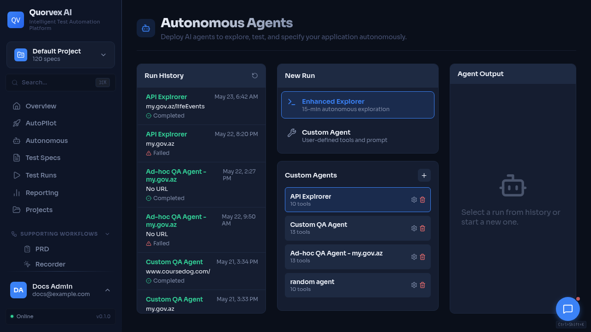

# Agent Run Temporal Runbook



<p class="caption">Agents dashboard showing standalone run status and operational controls.</p>

Standalone agent runs are durable only when Temporal and the custom workflow worker are healthy. The API fails closed when Temporal is unavailable. Agent execution is handled by Temporal activities; the Redis agent queue is not required for new agent runs.

## Required Runtime

- `TEMPORAL_ADDRESS`: Temporal frontend address, for example `temporal:7233` in Docker.
- `TEMPORAL_NAMESPACE`: Temporal namespace, usually `default`.
- `TEMPORAL_WORKFLOW_TASK_QUEUE`: task queue used by `AgentRunWorkflow`, default `quorvex-custom-workflows`.
- `TEMPORAL_UI_URL`: optional UI URL surfaced in run diagnostics.
- Worker: `python -m orchestrator.services.custom_workflow_worker`.

The same worker registers `CustomWorkflowRun`, `AgentRunWorkflow`, and `DomainJobWorkflow`.
The worker contract should include the `direct_agent_execution` capability.

## Verify Health

```bash
curl http://localhost:8001/api/agents/temporal/health
curl http://localhost:8001/workflows/temporal/health
```

Both responses should show `available: true` and the expected workflow task queue.

## Run The Smoke Test

```bash
make agent-temporal-smoke-up
make agent-temporal-smoke
```

The smoke test creates a deterministic no-op agent run, starts `AgentRunWorkflow`, waits for completion, and verifies the expected event sequence.

## Inspect A Stuck Agent Run

1. Open the agent run details page and check the Temporal panel.
2. Confirm `temporal_workflow_id`, namespace, task queue, workflow status, activity count, retry count, and last failure.
3. Open Temporal UI from the displayed link when `TEMPORAL_UI_URL` is configured.
4. Check worker logs:

```bash
make agent-temporal-smoke-logs
make workers-logs
```

## Expected Failure Behavior

If Temporal cannot start a workflow, the API returns `503`, marks the run `failed`, stores the error in `result`, and emits `temporal_start_failed`. This is intentional; standalone agent runs must not start through non-durable background execution.

New agent runs should not create Redis `agent_task_id` values. Existing rows may still display an old task id for historical diagnostics, but pause, resume, and cancel are controlled through Temporal signals.

## Release Checklist

- Apply migrations through revision `035`.
- Deploy backend and `custom_workflow_worker` together.
- Verify `/api/agents/temporal/health`.
- Run `make agent-temporal-smoke`.
- Confirm the agents UI shows workflow status and no Temporal error for the smoke run.
- Confirm new exploratory, synthesis, and custom agent runs record `temporal_workflow_id`.
- Confirm requirements generation, bulk spec generation, and RTM generation return `temporal_workflow_id`.
