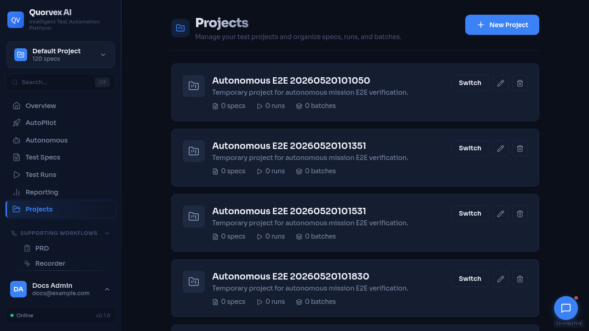

# How to Deploy Quorvex AI On-Premises



<p class="caption">Projects dashboard for company workspace and membership setup.</p>


Deploy Quorvex AI to an on-premises or private network environment with company DNS and company-managed nginx terminating TLS in front of the Compose app.

## Prerequisites

- A Linux VM with at least 8 CPU cores, 32 GB RAM, and 200 GB SSD (Ubuntu 22.04 LTS recommended)
- Docker Engine and Docker Compose v2 installed
- Network access to your AI provider API (direct or via proxy)
- An internal Git repository for hosting the code
- A dedicated internal subdomain, for example `quorvex.example.com`
- Company nginx or a load balancer that can proxy HTTP and WebSocket traffic
- Organization-issued TLS certificates on the company nginx endpoint

## Recommended: Private Deploy Repo

Keep local development in the public/source repo unchanged. For production, use
a separate private deploy repo on the server. The public installer can create
missing private deployment files from `deploy/private-repo-template/`, report
what was missing, run bootstrap checks, and dry-run a tagged release:

```bash
GITHUB_TOKEN=... \
QUORVEX_DEPLOY_REPO=<owner>/<private-deploy-repo> \
QUORVEX_DOMAIN=quorvex.example.com \
QUORVEX_VERSION=v1.2.3 \
bash -c "$(curl -fsSL https://raw.githubusercontent.com/NihadMemmedli/quorvex_ai/main/deploy/install-server.sh)"
```

The command above does not start or replace containers. It validates the private
repo and runs `./scripts/deploy.sh --dry-run v1.2.3`. To run the
runtime-changing deployment in the same command, add
`QUORVEX_CONFIRM_DEPLOY=true`.

Normal release after the public repository tag has published GHCR images:

```bash
./scripts/deploy.sh v1.2.3
```

Emergency rollback:

```bash
./scripts/rollback.sh
```

The private repo stores real files such as `env/quorvex.prod.env`,
`compose/docker-compose.<site>.yml`, `reverse-proxy/<domain>.conf`, and
`.state/current-version`. Do not commit those files to the public repo.

## Step 1: Prepare Code for Internal Git

Push the repository to a clean internal Git server:

```bash
cd /path/to/quorvex_ai

# Create orphan branch with single commit (no dev history)
git checkout --orphan clean-main
git add -A
git commit -m "Initial commit: AI-Powered Test Automation Platform"
git branch -M main

# Add internal remote and push
git remote add origin https://gitlab.example.com/qa/quorvex_ai.git
git push -u origin main
```

Verify no secrets leaked into tracked files:

```bash
git ls-files | xargs grep -l "password\|secret\|token\|api.key" 2>/dev/null
# Expected: only .env.prod.example (with placeholders), CLAUDE.md, docs/
```

!!! danger
    `.gitignore` excludes `.env`, `.env.prod`, `test.db*`, `runs/`, `logs/`, `node_modules/`, `venv/`. Verify no secrets are in tracked files before pushing.

## Step 2: Install Prerequisites on the VM

```bash
# Install Docker Engine
curl -fsSL https://get.docker.com | sh
sudo usermod -aG docker $USER
newgrp docker

# Install Docker Compose plugin (if not bundled)
sudo apt-get install -y docker-compose-plugin

# Verify
docker --version
docker compose version
```

If behind a corporate proxy, configure Docker daemon proxy:

```bash
sudo mkdir -p /etc/systemd/system/docker.service.d
sudo tee /etc/systemd/system/docker.service.d/http-proxy.conf <<EOF
[Service]
Environment="HTTP_PROXY=http://proxy.example.com:8080"
Environment="HTTPS_PROXY=http://proxy.example.com:8080"
Environment="NO_PROXY=localhost,127.0.0.1,*.example.com"
EOF
sudo systemctl daemon-reload
sudo systemctl restart docker
```

## Step 3: Run The Installer Dry-Run

```bash
GITHUB_TOKEN=... \
QUORVEX_DEPLOY_REPO=<owner>/<private-deploy-repo> \
QUORVEX_DOMAIN=quorvex.example.com \
QUORVEX_VERSION=v1.2.3 \
QUORVEX_ACTIVE_LLM_PROVIDER=zai \
ZAI_API_KEY=... \
bash -c "$(curl -fsSL https://raw.githubusercontent.com/NihadMemmedli/quorvex_ai/main/deploy/install-server.sh)"
```

The installer clones or updates the public repo and private deploy repo, reports
missing private files, creates missing files from templates, generates local app
secrets if placeholders remain, runs bootstrap checks, and dry-runs the release.
It keeps browser API URLs blank for same-origin company nginx mode.

The resulting private env contains these deployment values:

```bash title=".env.prod"
QUORVEX_ACTIVE_LLM_PROVIDER=zai
REQUIRE_AUTH=true
ALLOW_REGISTRATION=false
ALLOWED_ORIGINS=https://quorvex.example.com
TEMPORAL_CORS_ORIGINS=https://quorvex.example.com
VNC_PUBLIC_WS_URL=wss://quorvex.example.com/websockify
RECORDER_BROWSER_URL=
QUORVEX_PUBLIC_API_URL=
NEXT_PUBLIC_API_URL=
INTERNAL_API_URL=http://backend:8001
NO_PROXY=localhost,127.0.0.1,db,redis,minio,zap,backend,frontend,temporal,hermes
```

If provider credentials are not already stored in the private repo, pass the
matching provider key in the installer environment. Secret values are not
printed.

## Step 4: Configure Company Nginx

Use company DNS and company nginx as the public entrypoint. The Compose app should not use the repo-managed nginx container for this deployment mode.

Required proxy routes:

- `https://quorvex.example.com/` -> `http://<app-server>:3000`
- `https://quorvex.example.com/websockify` -> `http://<app-server>:6080/websockify`

The `/websockify` location must preserve WebSocket upgrade headers. Use long proxy timeouts for dashboard/backend requests and large enough upload limits for artifacts and specs.

Leave `RECORDER_BROWSER_URL` blank unless company nginx also proxies
`/vnc.html` and the noVNC assets. If that route is added, set
`RECORDER_BROWSER_URL=https://quorvex.example.com/vnc.html?autoconnect=true&resize=scale`.

```nginx
map $http_upgrade $connection_upgrade {
    default upgrade;
    ''      '';
}

upstream quorvex_frontend {
    server <app-server>:3000;
    keepalive 32;
}

upstream quorvex_backend {
    server <app-server>:6080;
    keepalive 32;
}

server {
    listen 443 ssl http2;
    server_name quorvex.example.com;

    ssl_certificate /etc/nginx/certs/quorvex.example.com/fullchain.pem;
    ssl_certificate_key /etc/nginx/certs/quorvex.example.com/privkey.pem;

    client_max_body_size 50m;

    location /websockify {
        proxy_pass http://quorvex_backend/websockify;
        proxy_http_version 1.1;
        proxy_set_header Host $host;
        proxy_set_header Upgrade $http_upgrade;
        proxy_set_header Connection $connection_upgrade;
        proxy_set_header X-Forwarded-Proto https;
        proxy_read_timeout 3600s;
        proxy_send_timeout 3600s;
    }

    location / {
        proxy_pass http://quorvex_frontend;
        proxy_http_version 1.1;
        proxy_set_header Host $host;
        proxy_set_header X-Real-IP $remote_addr;
        proxy_set_header X-Forwarded-For $proxy_add_x_forwarded_for;
        proxy_set_header X-Forwarded-Proto https;
        proxy_set_header Upgrade $http_upgrade;
        proxy_set_header Connection $connection_upgrade;
        proxy_connect_timeout 60s;
        proxy_send_timeout 600s;
        proxy_read_timeout 600s;
    }
}
```

## Step 5: Dry-Run Or Deploy The Release

```bash
# From the private deploy repo: validate only
./scripts/deploy.sh --dry-run v1.2.3

# From the private deploy repo: pull images, back up, and start/update services
./scripts/deploy.sh v1.2.3
```

Services started:

| Service | Port | Purpose |
|---------|------|---------|
| Backend | 8001 | API server + Playwright browsers + VNC |
| Frontend | 3000 | Next.js web dashboard |
| PostgreSQL | 5432 | Database |
| Redis | 6379 | Rate limiting + job queue |
| MinIO | 9000/9001 | Object storage for backups |
| Temporal | 7233 | Durable workflow engine for autonomous missions |
| Temporal UI | 8233 | Workflow inspection UI |
| Backup Scheduler | -- | Automated daily backups |
| Live browser WebSocket | 6080 | websockify target for company nginx `/websockify` |
| ZAP | 8090 | Security scanner API, private |

## Step 6: Back Up `.env.prod` Immediately

!!! danger
    `JWT_SECRET_KEY` encrypts integration credentials (TestRail API keys, Jira tokens, etc.). Losing it means all encrypted credentials become **unrecoverable**. Store `.env.prod` in your password manager or secure vault immediately.

## Step 7: Verify the Deployment

```bash
# Runtime readiness
make agent-runtime-ready

# App-server checks
curl -sf http://localhost:3000
curl -sf http://localhost:8001/health
curl -sf http://localhost:8001/health/storage
```

Company-workstation verification:

1. Log in to the dashboard with admin credentials
2. Confirm dashboard API calls work without CORS errors
3. Start a small browser-backed run
4. Confirm the live browser view connects through `wss://quorvex.example.com/websockify`
5. Check the browser console and network panel for failed `localhost`, `127.0.0.1`, direct `:6080`, or mixed-content requests

Backup verification:

```bash
make backup-full
make backup-status
```

## Step 8: Set Up Health Monitoring

```bash
chmod +x scripts/health-monitor.sh

# Test manually
./scripts/health-monitor.sh

# Add to cron (every 5 minutes)
(crontab -l 2>/dev/null; echo "*/5 * * * * /opt/quorvex_ai/scripts/health-monitor.sh") | crontab -
```

## Daily Operations

| Time | Task | Service |
|------|------|---------|
| 2:00 AM | Full backup with MinIO sync | backup-scheduler (automatic) |
| 3:00 AM | Artifact archival | backup-scheduler (automatic) |
| Daily | `make health-check` | Manual check |
| Weekly | `df -h`, `make volume-sizes` | Disk monitoring |

## Upgrading

```bash
cd /opt/quorvex_ai
git pull origin main
make upgrade    # Backup -> rebuild -> migrate -> restart -> verify
```

Rollback if needed:

```bash
make db-downgrade
git checkout <previous-commit>
make prod-build && make prod-up
```

## Verification

Confirm the full deployment:

1. `make health-check` passes all endpoints
2. Dashboard login works with admin credentials
3. Test execution completes with VNC showing browser activity
4. Live browser view connects through the company `/websockify` proxy
5. `make backup-full` creates a backup visible in MinIO console (port 9001)
6. Health monitoring cron is active: `crontab -l | grep health-monitor`

Do not use `docker-compose.swarm.yml`, `docker-compose.minimal.yml`, or
`docker-compose.autopilot-stable.yml` for company deployment unless they are
explicitly hardened for same-origin API routing and company VNC URLs.

## Related Guides

- [Deployment](./deployment.md) -- all deployment modes (local, Docker, Swarm, K8s)
- [Disaster Recovery](./disaster-recovery.md) -- recovery procedures
- [Authentication](./authentication.md) -- user and role management
- [Troubleshooting](./troubleshooting.md) -- common production issues
