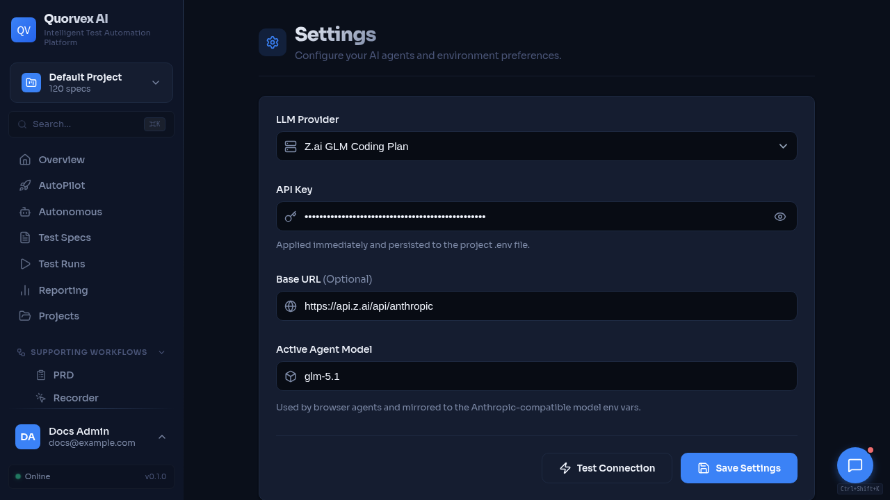

# How to Deploy Quorvex AI



<p class="caption">Settings dashboard used to verify deployment configuration.</p>


Choose a deployment mode and configure it for your environment, from local development to Kubernetes auto-scaling.

## Prerequisites

- Docker and Docker Compose v2 (for all modes except local dev)
- An `.env` or `.env.prod` file with required secrets
- For Kubernetes: a cluster with kubectl configured and a container registry

## Deployment Modes Overview

| Mode | Use Case | Command | Scaling |
|------|----------|---------|---------|
| Local dev | Solo developer | `make dev` | Single instance |
| Minimal Docker | Quick demo, low-resource machine | `docker compose -f docker-compose.minimal.yml up -d` | Single instance |
| Docker dev | Team/reproducible | `make docker-up` | Single instance |
| Production (Standard) | Small team, VNC | `make prod-up` | 1 backend + browsers |
| Production (Workers) | Medium team | `make workers-up` | N browser containers |
| Docker Swarm | Enterprise, simpler | `make swarm-up` | Overlay networking |
| Kubernetes | Enterprise, auto-scale | `make k8s-deploy` | HPA auto-scaling |

## Local Development

The simplest development mode. It runs the backend and frontend as local processes. If Docker is available, `make dev` starts a PostgreSQL container; otherwise it falls back to SQLite.

```bash
make setup    # One-time: venv, deps, browsers
make check-env
make dev      # Start backend (port 8001) + frontend (port 3000)
```

`make dev` executes `start-ui.sh`, which:

1. Kills any existing processes on ports 8001 and 3000
2. Starts a PostgreSQL container if Docker is available (falls back to SQLite)
3. Launches the FastAPI backend with `uvicorn --reload`
4. Launches the Next.js frontend with `npm run dev`

Services:

| Service | URL |
|---------|-----|
| Dashboard | http://localhost:3000 |
| Backend API | http://localhost:8001 |
| API Docs (Swagger) | http://localhost:8001/docs |

Logs are written to `api.log` and `web.log` in the project root.

```bash
make stop     # Stop all services
make logs     # Tail backend + frontend logs
```

## Docker Development

Run all services in containers using `docker-compose.yml`.

```bash
make docker-build    # Build images
make docker-up       # Start all services
make docker-down     # Stop all services
```

## Production Deployment (Docker Compose)

Production uses `docker-compose.prod.yml` with an `.env.prod` configuration file.

### Prerequisites

1. Docker and Docker Compose v2
2. An `.env.prod` file with production secrets

### Create Production Environment File

```bash
cp .env.prod.example .env.prod
```

Edit `.env.prod` with production values:

```bash
# Required secrets
ANTHROPIC_AUTH_TOKEN=your-production-token
JWT_SECRET_KEY=$(openssl rand -hex 32)
POSTGRES_PASSWORD=$(openssl rand -hex 16)
MINIO_ROOT_PASSWORD=$(openssl rand -hex 16)

# Security settings
REQUIRE_AUTH=true
ALLOW_REGISTRATION=false

# Optional: initial admin user
INITIAL_ADMIN_EMAIL=admin@yourcompany.com
INITIAL_ADMIN_PASSWORD=your-secure-password
```

Validate the file before startup:

```bash
make check-env
```

### Standard Mode (with VNC)

Runs a single backend container with Playwright browsers and VNC streaming. Best for small teams that need live browser observation.

```bash
make prod-up
```

Services started:

| Service | URL | Description |
|---------|-----|-------------|
| Dashboard | http://localhost:3000 | Next.js frontend |
| API | http://localhost:8001 | FastAPI backend |
| VNC View | http://localhost:6080 | Live browser (noVNC) |
| MinIO Console | http://localhost:9001 | Object storage admin |
| Temporal | localhost:7233 | Durable workflow engine for autonomous missions |
| Temporal UI | http://localhost:8233 | Temporal workflow inspection UI |

The backend container uses **supervisord** to manage:
- Xvfb (virtual display at `:99`, 1920x1080x24)
- Fluxbox (window manager)
- x11vnc (VNC server)
- websockify (WebSocket bridge on port 6080)
- uvicorn (API server on port 8001)
- agent worker, autonomous mission worker, and custom workflow worker processes

Resource allocation: 24 GB memory limit, 8 CPUs, 2 GB shared memory.

### Development Mode (Local Code Mounting)

Mount local source code into production containers for faster iteration without rebuilding:

```bash
make prod-dev
```

Changes to `orchestrator/` auto-reload via `uvicorn --reload`. Changes to `web/src/` auto-reload via Next.js.

### Workers Mode (Isolated Browsers)

Separates browsers into dedicated worker containers. The backend runs as a slim image (no browsers, 4 GB memory instead of 24 GB). Workers communicate via Redis job queue.

```bash
make workers-up              # Start with default 4 workers
make workers-scale N=8       # Scale to 8 workers
make workers-status          # View worker status and resource usage
make workers-logs            # Tail worker logs
make workers-down            # Stop everything
```

Architecture in workers mode:

```
Frontend (port 3000)
    |
Backend-Slim (port 8001, no browsers)
    |
Redis (job queue)
    |
+---+---+---+---+
| W1 | W2 | W3 | W4 |   <-- browser-workers (scalable)
+---+---+---+---+
```

Each worker container has:
- 2 GB memory limit, 2 CPUs
- 1 GB shared memory
- Isolated Chromium browser instance

### Production Commands Reference

```bash
make prod-up              # Start standard mode
make prod-down            # Stop services (30s graceful timeout)
make prod-down-safe       # Backup first, then stop
make prod-restart         # Restart backend only (picks up code changes)
make prod-logs            # Tail backend + frontend logs
make prod-build           # Rebuild images (with cache)
make prod-build-no-cache  # Rebuild images (fresh, no cache)
make prod-status          # Service status + health check
```

### Upgrading Production

```bash
make upgrade
```

This runs a 6-step procedure:

1. Pre-flight health check
2. Full backup (DB + specs + tests + PRDs)
3. `git pull` latest code
4. Rebuild Docker images
5. Run database migrations
6. Restart services and verify health

Rollback if something goes wrong:

```bash
make db-downgrade              # Roll back migration
git checkout <previous-tag>    # Revert code
make prod-build && make prod-up  # Rebuild and restart
```

## Backup and Recovery

### Running Backups

```bash
make backup              # Database only
make backup-full         # DB + specs + tests + PRDs + ChromaDB
make backup-status       # View backup history
```

Backups are stored in the `backup_data` Docker volume and optionally synced to MinIO.

### Restoring from Backup

```bash
make restore-list                    # List available backups
make restore TS=20260208_143022      # Restore from timestamp
make restore-from-minio TS=...      # Restore from MinIO
```

### Scheduled Backups

The `backup-scheduler` service runs in production and executes:
- **2 AM daily**: Full backup with MinIO sync
- **3 AM daily**: Artifact archival (hot/warm/cold retention tiers)

### Artifact Retention

| Tier | Age | Storage | Contents |
|------|-----|---------|----------|
| Hot | 0-30 days | Local (`runs/`) | All artifacts |
| Warm | 30-90 days | MinIO | Core artifacts only (plan.json, validation.json, report.html) |
| Cold | 90+ days | Deleted | Database metadata only |

```bash
make archival             # Run archival now
make archival-dry-run     # Preview what would be archived
make storage-health       # Check storage health
```

## Docker Swarm

For enterprise deployments without Kubernetes. Uses Docker's built-in orchestration with overlay networking and rolling updates.

### Deploy

```bash
# Initialize Swarm (if not already)
docker swarm init

# Deploy the stack
make swarm-up
```

### Scale

```bash
make swarm-scale N=8       # Scale browser workers to 8
make swarm-status          # View service status
make swarm-down            # Remove stack
```

### Stack Architecture

Defined in `docker-compose.swarm.yml`:

| Service | Replicas | Resources |
|---------|----------|-----------|
| browser-workers | 4 (scalable) | 2 GB / 2 CPUs per replica |
| backend (slim) | 2 | 4 GB / 4 CPUs per replica |
| frontend | 2 | 512 MB / 0.5 CPUs |
| redis | 1 | 256 MB |
| postgres | 1 (manager node) | 4 GB / 2 CPUs |

Rolling updates are configured with:
- Parallelism: 2 (workers), 1 (backend)
- Delay: 10 seconds between batches
- Failure action: rollback

## Kubernetes

Enterprise auto-scaling deployment with HPA (Horizontal Pod Autoscaler).

### Prerequisites

- Kubernetes cluster 1.24+
- `kubectl` configured
- Container registry for images
- nginx-ingress controller (optional, for external access)
- Storage class for PersistentVolumeClaims

### Deploy

```bash
# 1. Configure secrets
cp k8s/secrets.yaml k8s/secrets.local.yaml
# Edit secrets.local.yaml with your values
# make k8s-deploy applies secrets.local.yaml before the rest of the manifests.
# If secrets.local.yaml is missing, the target asks before applying the template.

# 2. Build and push images
docker build -t your-registry/quorvex-backend:latest -f Dockerfile .
docker build -t your-registry/quorvex-worker:latest -f docker/browser-worker/Dockerfile .
docker build -t your-registry/quorvex-backend-slim:latest -f docker/backend-slim/Dockerfile .
docker build -t your-registry/quorvex-frontend:latest -f web/Dockerfile web/
docker build -t your-registry/quorvex-k6-worker:latest -f docker/k6-worker/Dockerfile .
docker push your-registry/quorvex-backend:latest
docker push your-registry/quorvex-worker:latest
docker push your-registry/quorvex-backend-slim:latest
docker push your-registry/quorvex-frontend:latest
docker push your-registry/quorvex-k6-worker:latest

# 3. Update kustomization.yaml image overrides with your registry
# 4. Deploy
make k8s-deploy
```

### Auto-Scaling Configuration

The HPA in `k8s/browser-worker-deployment.yaml` is configured as:

| Parameter | Value |
|-----------|-------|
| Min replicas | 2 |
| Max replicas | 20 |
| CPU target | 70% utilization |
| Memory target | 80% utilization |
| Scale-up delay | Immediate |
| Scale-down delay | 5 minutes |

### Manage

```bash
make k8s-status          # Pods, services, HPA, ingress
make k8s-scale N=10      # Manual scale (HPA may override)
make k8s-logs            # Interactive log tailing
make k8s-delete          # Remove all resources
```

### Resource Limits

| Component | CPU Request/Limit | Memory Request/Limit |
|-----------|-------------------|----------------------|
| Browser Worker | 1 / 2 | 1 Gi / 2 Gi |
| Backend | 1 / 4 | 1 Gi / 4 Gi |
| Frontend | 250m / 500m | 256 Mi / 512 Mi |
| PostgreSQL | 500m / 2 | 1 Gi / 4 Gi |
| Redis | 100m / 500m | 64 Mi / 256 Mi |

### Persistent Volumes

| PVC | Size | Purpose |
|-----|------|---------|
| postgres-pvc | 10 Gi | Database storage |
| runs-pvc | 50 Gi | Test run artifacts |
| logs-pvc | 10 Gi | Application logs |
| specs-pvc | 5 Gi | Test specifications |
| tests-pvc | 10 Gi | Generated tests |
| test-results-pvc | 20 Gi | Playwright reports |
| minio-pvc | 50 Gi | MinIO object storage |
| prds-pvc | 10 Gi | Uploaded PRD files |
| data-pvc | 20 Gi | Runtime data such as memory stores |
| backup-pvc | 20 Gi | Local backup staging |

### Kubernetes Files

All manifests are in `k8s/`:

| File | Purpose |
|------|---------|
| `kustomization.yaml` | Kustomize configuration and image overrides |
| `namespace.yaml` | `quorvex` namespace |
| `secrets.yaml` | Secret template (copy to `secrets.local.yaml`) |
| `configmap.yaml` | Non-secret configuration |
| `backend-deployment.yaml` | Backend slim deployment (2 replicas) |
| `frontend-deployment.yaml` | Frontend deployment |
| `browser-worker-deployment.yaml` | Worker deployment + HPA |
| `postgres-deployment.yaml` | PostgreSQL StatefulSet |
| `temporal-deployment.yaml` | Temporal server and UI |
| `redis.yaml` | Redis deployment |
| `minio-deployment.yaml` | MinIO object storage |
| `agent-worker-deployment.yaml` | Agent queue workers |
| `autonomous-mission-worker-deployment.yaml` | Temporal autonomous mission worker |
| `k6-worker-deployment.yaml` | K6 load-test worker |
| `zap-deployment.yaml` | OWASP ZAP daemon |
| `backup-cronjob.yaml` | Scheduled backup job |
| `archival-cronjob.yaml` | Artifact archival job |
| `scripts-configmap.yaml` | Operational scripts mounted into jobs |
| `pvc.yaml` | PersistentVolumeClaims |
| `ingress.yaml` | Ingress rules for external access |

## Database Migrations

When deploying model changes to PostgreSQL:

```bash
make db-migrate M="describe your change"   # Generate migration
make db-upgrade                              # Apply pending migrations
make db-downgrade                            # Roll back one step
make db-history                              # View migration history
make db-stamp R=001                          # Stamp existing DB at revision
```

Migrations are stored in `orchestrator/migrations/versions/` and managed by Alembic.

## Reverse Proxy with Nginx

The production stack starts the nginx profile by default through `make prod-up`. The checked-in nginx config is an HTTP reverse proxy on port 80. Terminate TLS at an external load balancer, ingress controller, or update `nginx/nginx.conf` with `listen 443 ssl` and certificate directives before relying on container-local TLS.

To start the same profiles manually:
   ```bash
   docker compose --env-file .env.prod -f docker-compose.prod.yml --profile standard --profile nginx --profile backup-scheduler up -d
   ```

Nginx proxies to the backend and frontend. Port 443 is exposed by Compose for custom TLS configs, but the default config does not enable TLS.

## Health Checks

All production services include health checks:

```bash
make health-check    # Hit all health endpoints
```

Available health endpoints:

| Endpoint | Purpose |
|----------|---------|
| `GET /health` | Backend API status |
| `GET /health/storage` | Local + MinIO storage status |
| `GET /health/backup` | Last backup status |
| `GET /health/alerts` | Active alerts |

## Maintenance Commands

```bash
make docker-prune     # Remove dangling images, stopped containers, build cache
make volume-sizes     # Show Docker volume sizes
make db-vacuum        # Run VACUUM ANALYZE on PostgreSQL
make deps-lock        # Capture venv versions to requirements.freeze (NOT requirements.lock)
```

## Verification

After deployment, confirm everything works:

1. `make health-check` passes all endpoints
2. Dashboard loads at the configured URL
3. Login works with admin credentials (if auth is enabled)
4. A test spec runs and completes through the pipeline
5. Backups are being created (check `make backup-status`)

## Related Guides

- [Company Deployment](./company-deployment.md) -- on-premises deployment walkthrough
- [Disaster Recovery](./disaster-recovery.md) -- backup and recovery procedures
- [Artifact Storage Lifecycle](../explanation/artifact-storage-lifecycle.md) -- hot/warm/cold artifact retention
- [Database Migration Architecture](../explanation/database-migration-architecture.md) -- Alembic and startup migration behavior
- [Authentication](./authentication.md) -- enable auth and manage users
- [Troubleshooting](./troubleshooting.md) -- diagnose deployment issues
