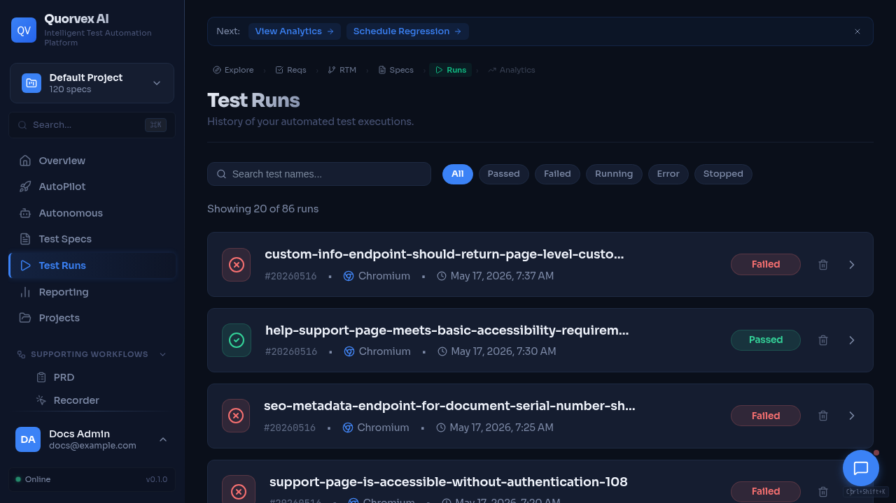

# How to Diagnose and Fix Common Issues



<p class="caption">Test runs dashboard used to debug execution failures.</p>


Expanded troubleshooting guide for resolving setup, pipeline, authentication, browser, database, Docker, and Kubernetes problems.

## Prerequisites

- Access to the Quorvex AI server or development environment
- Ability to run CLI commands and view logs

## Step 1: Run Quick Diagnostics

Before investigating specific issues, gather system state:

```bash
make check-env          # Validate configuration
make health-check       # Hit all health endpoints
make prod-status        # Docker service status (production)
```

Check log files:

```bash
tail -f api.log         # Backend API logs (local dev)
tail -f web.log         # Frontend logs (local dev)
make prod-logs          # Docker production logs
```

## Setup and Configuration Issues

### "ANTHROPIC_AUTH_TOKEN not set"

**Symptom**: CLI or API fails with missing token error.

**Fix**:
```bash
make check-env
# Edit .env and set ANTHROPIC_AUTH_TOKEN=your-actual-token
```

If running in Docker, ensure `.env.prod` has the variable and restart:
```bash
make prod-restart
```

### "ModuleNotFoundError: No module named 'orchestrator'"

**Fix**: Activate the virtual environment:
```bash
source venv/bin/activate
python orchestrator/cli.py specs/my-test.md
```

Or use `make run SPEC=...` which activates the venv automatically.

### "venv not found" or Missing Dependencies

**Fix**:
```bash
make setup
```

### Port 8001 or 3000 Already in Use

**Fix**:
```bash
make stop
```

If ports are still occupied:
```bash
lsof -ti :8001 | xargs kill -15
lsof -ti :3000 | xargs kill -15
```

## Test Generation Issues

### "No target URL found in spec"

**Cause**: The spec file does not contain a navigable URL.

**Fix**: Ensure your spec includes a URL starting with `http://` or `https://`:
```markdown
## Steps
1. Navigate to https://example.com
```

### Generated Test Selectors Fail

**Fix**:
1. Healer automatically retries (up to 3 attempts)
2. Use hybrid mode for extended healing:
   ```bash
   python orchestrator/cli.py specs/my-test.md --hybrid
   ```
3. Check if the target application requires authentication or changed its UI

### Test Times Out on Complex Pages

**Fix**: Increase agent timeouts in `.env`:
```bash
AGENT_TIMEOUT_SECONDS=3600
GENERATOR_TIMEOUT_SECONDS=3600
```

Or use hybrid mode for more healing attempts.

### SDK Cancel Scope Errors

**Symptom**: Error mentioning "cancel scope" in stderr.

**Cause**: Expected behavior -- the Claude Agent SDK throws cleanup errors during shutdown. These are handled automatically by the pipeline.

**If you see this in custom code**, apply the fix pattern:
```python
result_text = ""
try:
    result_text = await runner.run(prompt)
except Exception as e:
    if "cancel scope" in str(e).lower():
        pass  # SDK cleanup -- result_text already captured
    else:
        raise
# Parse result AFTER the except block
```

## Authentication Issues

### "Account locked"

**Symptom**: Login returns HTTP 423.

**Fix**: Wait 30 minutes for automatic unlock, or manually clear:
```sql
-- PostgreSQL
UPDATE users SET failed_login_attempts = 0, locked_until = NULL WHERE email = 'user@example.com';
```

### "Invalid token" Errors

**Cause**: Access token expired (15-minute lifetime) or JWT secret key changed.

**Fix**:
1. Refresh using `POST /auth/refresh` with your refresh token
2. If refresh token expired (7 days), re-login
3. If `JWT_SECRET_KEY` changed, all tokens are invalidated -- users must re-login

### Registration Disabled

**Fix**: Set `ALLOW_REGISTRATION=true` in `.env` and restart.

## Browser Pool Issues

### Browser Slots Exhausted

**Symptom**: Tests queue up and timeout with "Could not acquire browser slot".

**Diagnostics**:
```bash
curl http://localhost:8001/api/browser-pool/status | python3 -m json.tool
```

**Fix**:
1. Wait for running operations to complete
2. Increase limit: `MAX_BROWSER_INSTANCES=10` in `.env`
3. Force cleanup: `curl -X POST http://localhost:8001/api/browser-pool/cleanup`
4. Scale browser workers: `make workers-up && make workers-scale N=8`

### Exploration Stops Early

**Fix**: Increase limits:
```bash
python orchestrator/cli.py --explore https://example.com --max-interactions 100 --timeout 60
```

## Database Issues

### "Database connection refused"

**Fix** (PostgreSQL in Docker):
```bash
docker compose up -d db
# or
make prod-up
```

**Fix** (SQLite fallback):
```bash
# In .env; omit DATABASE_URL to use the default local SQLite path,
# or set an explicit file path:
DATABASE_URL=sqlite:///./orchestrator/data/playwright_agent.db
```

### Migration Errors

**Fix**:
```bash
# Check migration state
make db-history

# If schema already exists, stamp it
make db-stamp R=001

# Apply pending migrations
make db-upgrade
```

### Auth Endpoints Return 500 After Restore

**Cause**: Missing database columns after Alembic restore.

**Fix**:
```bash
docker compose --env-file .env.prod -f docker-compose.prod.yml exec db \
  psql -U playwright -d playwright_agent -c "
    ALTER TABLE users ADD COLUMN IF NOT EXISTS last_login TIMESTAMP;
    ALTER TABLE refresh_tokens ADD COLUMN IF NOT EXISTS device_info VARCHAR;
    ALTER TABLE refresh_tokens ADD COLUMN IF NOT EXISTS ip_address VARCHAR;
  "
make prod-restart
```

## Docker / Production Issues

### Container OOM (Out of Memory)

**Symptom**: Container killed with exit code 137.

**Fix**:
1. Check usage: `docker stats`
2. Increase limits in `docker-compose.prod.yml`
3. Ensure `shm_size: 2gb` for the backend
4. Consider workers mode: `make workers-up`

### VNC Not Connecting

**Fix**:
1. Verify `VNC_ENABLED=true` in `.env.prod`
2. Check supervisord status:
   ```bash
   docker compose --env-file .env.prod -f docker-compose.prod.yml --profile standard exec backend supervisorctl status
   ```
   X/VNC processes, uvicorn, and worker processes should be `RUNNING`.

### Backup Services Can't Connect

**Symptom**: DNS errors like `lookup minio: no such host`.

**Fix**: Ensure backup services have `networks: - playwright-network` in `docker-compose.prod.yml`.

### Redis Connection Failed

**Fix**:
```bash
docker ps | grep redis
docker compose --env-file .env.prod -f docker-compose.prod.yml --profile standard restart redis
docker compose --env-file .env.prod -f docker-compose.prod.yml --profile standard exec redis redis-cli ping
```

The application degrades gracefully: rate limiting uses in-memory storage and the agent queue falls back to direct execution.

### Temporal Unavailable for Durable Runs

**Symptom**: Autonomous mission, custom workflow, or standalone agent run APIs report durable orchestration is unavailable. New standalone agent runs fail with `503` and a `temporal_start_failed` event.

**Cause**: `TEMPORAL_ADDRESS` is not configured, the Temporal service is not reachable from the backend container, or the required Temporal worker is not running. Standalone agent runs and custom workflows require `orchestrator.services.custom_workflow_worker` on `TEMPORAL_WORKFLOW_TASK_QUEUE`.

**Fix**:
```bash
make prod-status
make autopilot-logs
make agent-temporal-smoke
```

Verify `TEMPORAL_ADDRESS`, `TEMPORAL_NAMESPACE`, `TEMPORAL_TASK_QUEUE`, and `TEMPORAL_WORKFLOW_TASK_QUEUE` in `.env.prod`, then restart the backend and worker stack. Standalone agent runs intentionally fail closed when Temporal is down; restore Temporal and retry the run.

### Long-Running Missions Retry Repeatedly

**Symptom**: A mission creates repeated attempts but never reaches approval or completion.

**Cause**: The target application is unreachable, credentials are invalid, browser slots are exhausted, or the mission definition is too broad for the configured timeout.

**Fix**:
1. Check mission logs with `make autopilot-logs`
2. Check browser capacity with `curl http://localhost:8001/api/browser-pool/status`
3. Increase `AGENT_TIMEOUT_SECONDS` or narrow the mission scope
4. Confirm project credentials are present and not expired

### K6 Workers Are Running but Jobs Stay Queued

**Symptom**: K6 worker containers are healthy, but load-test jobs remain queued.

**Cause**: Redis is unavailable, workers were started without the K6 profile, or the backend and workers are not using the same queue configuration.

**Fix**:
```bash
make k6-workers-status
make k6-workers-logs
docker compose --env-file .env.prod -f docker-compose.prod.yml --profile standard exec redis redis-cli ping
```

Restart the worker profile after Redis is healthy:
```bash
make k6-workers-down
make k6-workers-up
```

### Backups Succeed Locally but Fail to Upload to MinIO

**Symptom**: `make backup-full` creates local backup files, but MinIO upload fails.

**Cause**: MinIO credentials, bucket names, network aliases, or retention settings differ between `.env.prod` and the running containers.

**Fix**:
1. Open the MinIO console with `make minio-console`
2. Confirm `MINIO_ENDPOINT`, `MINIO_ROOT_USER`, `MINIO_ROOT_PASSWORD`, `MINIO_BUCKET`, and `MINIO_BUCKET_ARTIFACTS`
3. Run `make storage-health`
4. Restart backup-related services after env changes

### ZAP Reachable from Host but Not from Backend

**Symptom**: `curl http://localhost:8090` works on the host, but security scans fail from the backend.

**Cause**: The backend container cannot resolve the host's `localhost`; inside Docker, `localhost` refers to the backend container itself.

**Fix**:
```bash
make zap-status
make zap-logs
```

Use the Docker service name and internal port in container configuration, for example `ZAP_HOST=zap` and `ZAP_PORT=8090`, then restart the backend.

## Kubernetes Issues

### Pods Stuck in Pending

**Diagnostics**:
```bash
kubectl describe pod <pod-name> -n quorvex
kubectl get pvc -n quorvex
```

### HPA Not Scaling

**Fix**: Install metrics server if missing:
```bash
kubectl apply -f https://github.com/kubernetes-sigs/metrics-server/releases/latest/download/components.yaml
```

### Browser Worker Crashes

**Cause**: Insufficient shared memory for Chromium.

**Fix**: Increase `sizeLimit` for the `/dev/shm` emptyDir in `browser-worker-deployment.yaml`.

## Log File Locations

| Environment | Log | Location |
|-------------|-----|----------|
| Local dev | Backend | `api.log` (project root) |
| Local dev | Frontend | `web.log` (project root) |
| Docker prod | All | `make prod-logs` |
| Kubernetes | Backend | `kubectl logs -l app=backend -n quorvex` |
| Kubernetes | Workers | `kubectl logs -l app=browser-worker -n quorvex` |

## Health Endpoints

| Endpoint | Purpose |
|----------|---------|
| `GET /health` | Backend API status |
| `GET /health/storage` | Local + MinIO storage |
| `GET /health/backup` | Last backup info |
| `GET /health/alerts` | Active alerts |
| `GET /api/browser-pool/status` | Browser pool usage |
| `GET /api/agents/queue-status` | Agent queue status |

## Verification

After fixing any issue:

1. Run `make health-check` to verify all services are healthy
2. Run a simple test spec to confirm end-to-end functionality
3. Check the dashboard loads and can list specs/runs

## Related Guides

- [Getting Started](../tutorials/getting-started.md) -- initial setup
- [Deployment](./deployment.md) -- deployment modes and configuration
- [Disaster Recovery](./disaster-recovery.md) -- recovery from data loss
- [Authentication](./authentication.md) -- auth-specific issues
