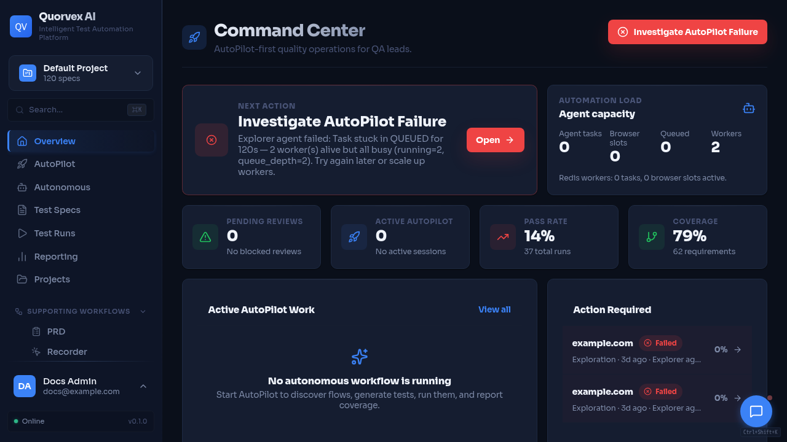

# YouTube MCP Production



This guide sets up a Codex-controlled YouTube production workflow for Quorvex episodes. It uses official MCP servers where available and repo-local FastMCP wrappers for YouTube upload safety and OBS recording control.

The default mode is dry run. No upload, scheduling, thumbnail update, metadata update, OBS recording start, scene switch, or OBS stop happens unless the user explicitly approves the action and the command passes the matching confirmation flags.

## Episode Layout

Episode source files live under:

```text
content/youtube/episodes/<EP>/
```

Generated artifacts live under:

```text
content/youtube/episodes/<EP>/build/
```

The upload dry-run manifest is:

```text
content/youtube/episodes/<EP>/build/youtube-upload-manifest.json
```

The OBS dry-run plan is:

```text
content/youtube/episodes/<EP>/build/obs-recording-plan.json
```

## Credentials

Keep credentials out of Git. Use `.secrets/`, `.env.local`, or shell environment variables.

YouTube upload server:

```bash
export YOUTUBE_CLIENT_SECRETS_FILE=.secrets/youtube/client_secret.json
export YOUTUBE_TOKEN_FILE=.secrets/youtube/token.json
export YOUTUBE_CHANNEL_ID=<channel-id>
export YOUTUBE_DRY_RUN=1
```

OBS server:

```bash
export OBS_WEBSOCKET_HOST=127.0.0.1
export OBS_WEBSOCKET_PORT=4455
export OBS_WEBSOCKET_PASSWORD=<obs-websocket-password>
export OBS_DRY_RUN=1
```

## Install Local Server Dependencies

```bash
python -m pip install -r tools/youtube_mcp/requirements.txt
python -m pip install -r tools/obs_mcp/requirements.txt
```

Confirmed YouTube API calls need Google OAuth token JSON in `YOUTUBE_TOKEN_FILE`. Dry-run checks do not require Google credentials or OBS connectivity.

## Add MCP Servers

Add the local YouTube upload wrapper:

```bash
codex mcp add youtube-upload \
  --env YOUTUBE_CLIENT_SECRETS_FILE=.secrets/youtube/client_secret.json \
  --env YOUTUBE_TOKEN_FILE=.secrets/youtube/token.json \
  --env YOUTUBE_DRY_RUN=1 \
  -- python tools/youtube_mcp/server.py
```

Add the local OBS wrapper:

```bash
codex mcp add obs \
  --env OBS_WEBSOCKET_HOST=127.0.0.1 \
  --env OBS_WEBSOCKET_PORT=4455 \
  --env OBS_DRY_RUN=1 \
  -- python tools/obs_mcp/server.py
```

Use account-specific setup docs for MCPs that require vendor auth. The intended production stack is:

```bash
# GitHub remote MCP
codex mcp add github -- <GitHub remote MCP command from your account setup>

# Playwright MCP
codex mcp add playwright -- npx -y @playwright/mcp

# ElevenLabs MCP
codex mcp add elevenlabs -- uvx elevenlabs-mcp

# Canva remote MCP
codex mcp add canva -- <Canva remote MCP command from your account setup>

# HeyGen remote MCP
codex mcp add heygen -- <HeyGen remote MCP command from your account setup>

# Descript and vidIQ
# Add these from their account-specific MCP setup instructions.
```

## Production Workflow

1. Generate the episode pack:

   ```bash
   make youtube-pack EP=001
   ```

2. Seed deterministic demo data:

   ```bash
   make youtube-demo-seed
   ```

3. Generate narration:

   ```bash
   make youtube-voice EP=001
   ```

4. Use Playwright MCP to verify the dashboard path and capture screenshots.

5. Prepare an OBS recording plan:

   ```bash
   make obs-recording-dry-run EP=001
   ```

6. After explicit approval, record with OBS and save the recording path.

7. Assemble the final MP4:

   ```bash
   make youtube-final EP=001 RECORDING=content/youtube/episodes/001/build/recording-demo-001.mov
   ```

8. Use Canva MCP to create thumbnail variants.

9. Prepare the upload dry run:

   ```bash
   make youtube-upload-dry-run EP=001
   ```

10. Review `youtube-upload-manifest.json`, then ask for explicit approval before confirmed upload or scheduling.

## Safety Model

YouTube mutating tools return dry-run summaries unless both conditions are true:

```text
confirm=true
YOUTUBE_DRY_RUN=0
```

OBS mutating tools return dry-run summaries unless both conditions are true:

```text
confirm=true
OBS_DRY_RUN=0
```

Confirmed upload from the Makefile:

```bash
make youtube-upload-confirm EP=001 VIDEO=content/youtube/episodes/001/build/youtube-001.mp4
```

Confirmed OBS recording start from the Makefile:

```bash
make obs-recording-confirm EP=001
```

## Verification

Static checks:

```bash
python -m py_compile tools/youtube_mcp/server.py tools/obs_mcp/server.py
python -m pytest tools/youtube_mcp tools/obs_mcp
```

MCP smoke checks:

```bash
timeout 5s python tools/youtube_mcp/server.py
timeout 5s python tools/obs_mcp/server.py
codex mcp list
make youtube-mcp-check
```

Dry-run acceptance:

```bash
make youtube-upload-dry-run EP=001
make obs-recording-dry-run EP=001
```

Expected results:

- `youtube-upload-manifest.json` is written under the episode `build/` folder.
- `obs-recording-plan.json` is written under the episode `build/` folder.
- No YouTube API mutation is made in dry-run mode.
- OBS is not controlled in dry-run mode.
- Missing files or credentials return actionable errors.
