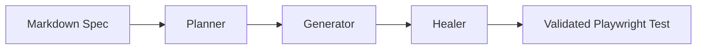
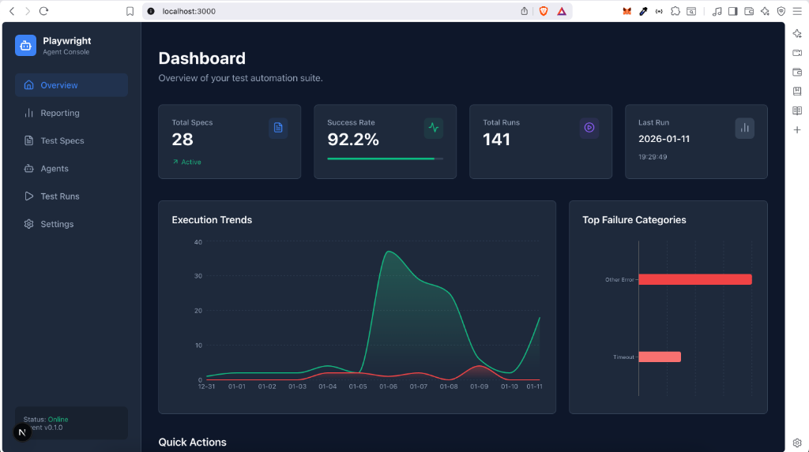

---
hide:
  - navigation
---

# Quorvex AI


<p class="caption">Quorvex dashboard overview with project quality and execution metrics.</p>


**Self-hosted AI testing for QA and engineering teams.**

Quorvex AI turns plain-English specs, PRDs, recordings, and app exploration into validated tests and quality signals. Generate Playwright UI tests, API checks, K6 load tests, security scans, database quality checks, mobile smoke flows, and LLM evaluation suites from one dashboard or CLI. For continuous discovery, autonomous missions can run on schedules or durable long-lived workflows with human approval before tests are created.

<div class="grid cards" markdown>

-   :material-text-box-outline: **Specs to Code**

    ---

    Write test cases in markdown and generate maintainable Playwright code with planning, validation, Smart Check reuse, and self-healing.

-   :material-auto-fix: **AI Self-Healing**

    ---

    When tests fail because selectors, waits, or page states changed, the healer debugs the run and attempts a repair before handing control back to you.

-   :material-robot-outline: **AutoPilot & Agents**

    ---

    Explore apps, generate tasks, run recurring or long-running autonomous testing missions, approve findings, and materialize useful discoveries into specs and tests.

-   :material-monitor-dashboard: **Web Dashboard**

    ---

    Manage specs, runs, PRDs, requirements, RTM, regression batches, analytics, workflows, credentials, projects, and integrations.

-   :material-layers-outline: **Multi-Domain Testing**

    ---

    Go beyond UI tests with OpenAPI/API testing, K6 load testing, ZAP and Nuclei security scans, database checks, mobile smoke tests, and LLM evaluations.

-   :material-compass-outline: **App Exploration**

    ---

    Discover pages, user flows, API endpoints, form behaviors, and coverage gaps. Feed findings directly into requirements and RTM.

-   :material-shield-lock-outline: **Enterprise Ready**

    ---

    Project isolation, RBAC, encrypted credentials, CI/CD integrations, PR advisor, quality gates, TestRail, Jira, schedules, queues, and backups.

</div>

## How It Works

Quorvex AI uses an agentic pipeline to convert specifications and discoveries into executable checks:



1. **Plan** -- The planner reads your spec or generated requirement, launches a browser when needed, and produces a structured execution plan.
2. **Generate** -- The generator uses the plan, target context, and memory to write executable automation code.
3. **Validate and heal** -- Quorvex runs the generated check, records artifacts, and attempts repairs when validation fails.

The same foundation powers AutoPilot, PRD-to-tests, API generation, specialized testing domains, custom workflows, and autonomous missions.

## Quick Start

| Setup | Best for | Command |
|-------|----------|---------|
| Full Docker dev | Main local workflow with dashboard, queues, storage, VNC, and frontend hot reload | `make dev` |
| Company/server runtime | App runtime for company-managed DNS/TLS/nginx | `make start` |
| Minimal Docker | Legacy local-only demo on smaller machines with SQLite | `docker compose -f docker-compose.minimal.yml up -d` |
| Repo-managed nginx | Legacy single-host path | `QUORVEX_ENABLE_REPO_NGINX=1 make prod-up` |

=== "Minimal Docker (Recommended)"

    ```bash
    git clone https://github.com/NihadMemmedli/quorvex_ai.git
    cd quorvex_ai
    cp .env.example .env
    # Edit .env with your AI provider token
    make check-env
    docker compose -f docker-compose.minimal.yml up -d
    ```

    Open [http://localhost:3000](http://localhost:3000) for the dashboard.

=== "Full Docker Dev"

    ```bash
    git clone https://github.com/NihadMemmedli/quorvex_ai.git
    cd quorvex_ai
    cp .env.prod.example .env.prod
    # Edit .env.prod with your AI provider token
    make dev
    ```

    Open [http://localhost:3000](http://localhost:3000) for the dashboard.

=== "Local Dev"

    ```bash
    git clone https://github.com/NihadMemmedli/quorvex_ai.git
    cd quorvex_ai
    make setup
    # Edit .env with your AI provider token
    make check-env
    make dev
    ```

=== "CLI Only"

    ```bash
    source venv/bin/activate
    python orchestrator/cli.py specs/your-test.md
    ```

!!! tip
    `make dev` starts the full Docker stack with local code mounting and frontend hot reload. See the [Getting Started](tutorials/getting-started.md) tutorial for the full walkthrough.



## Next Steps

<div class="grid cards" markdown>

-   :material-rocket-launch-outline: **[Getting Started](tutorials/getting-started.md)**

    ---

    Your first test in 10 minutes. Clone, setup, write a spec, and see a passing Playwright test.

-   :material-api: **[First API Test](tutorials/first-api-test.md)**

    ---

    Import an OpenAPI spec and generate validated API tests automatically.

-   :material-compass-outline: **[Explore an App](tutorials/first-exploration.md)**

    ---

    Use AI exploration to discover flows, generate requirements, and build a traceability matrix.

-   :material-monitor-dashboard: **[Dashboard Tour](tutorials/dashboard-walkthrough.md)**

    ---

    Visual walkthrough of the web dashboard and its key features.

-   :material-book-open-variant: **[How-to Guides](guides/writing-specs.md)**

    ---

    Task-oriented guides for API testing, load testing, security scans, scheduling, integrations, and more.

-   :material-source-branch: **[Choose a Setup Path](guides/setup-options.md)**

    ---

    Pick minimal Docker, full Docker, local dev, production, workers, or Kubernetes based on your goal.

-   :material-file-document-outline: **[Reference](reference/cli.md)**

    ---

    Complete CLI flags, API endpoints, environment variables, database schema, and Makefile commands.

-   :material-sitemap: **[Architecture](explanation/system-overview.md)**

    ---

    Understand the pipeline design, memory system, browser pool, and scaling model.

-   :material-github: **[GitHub Repository](https://github.com/NihadMemmedli/quorvex_ai)**

    ---

    Star the project, browse the source, and open issues or pull requests.

</div>
