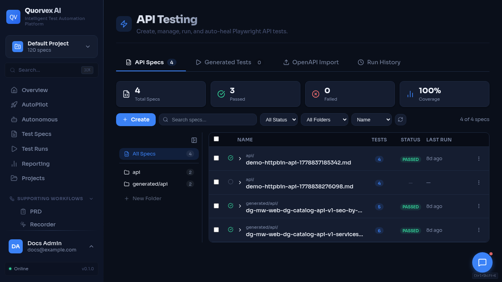

# API Router and Service Map

API testing dashboard showing API workflow entry points.

Backend ownership map for FastAPI routers and their primary service boundaries.

## Router Ownership

| Domain | Router source | Main path prefix | Primary service or workflow boundary |
|--------|---------------|------------------|--------------------------------------|
| Authentication | `orchestrator/api/auth.py` | `/auth` | `models_auth.py`, auth middleware |
| Users | `orchestrator/api/users.py` | `/users` | user and project membership models |
| Projects | `orchestrator/api/projects.py` | `/projects` | project, credential, membership models |
| Settings | `orchestrator/api/settings.py` | `/settings` | LLM and runtime settings validation |
| Core specs | `orchestrator/api/specs.py` | `/specs`, spec metadata routes | native planner, generator, healer, filesystem metadata |
| Run lifecycle | `orchestrator/api/runs.py` | `/runs` | process manager, run directories, generated artifacts |
| Runtime operations | `orchestrator/api/runtime_ops.py` | `/health`, `/queue-status`, `/api/browser-pool`, `/api/resources` | browser pool, resource manager, queue settings, emergency stop |
| Dashboard analytics | `orchestrator/api/dashboard.py`, `analytics.py` | dashboard-specific prefixes | run, spec, coverage, analytics queries |
| Memory | `orchestrator/api/memory.py` | `/api/memory` | `orchestrator/memory/*` |
| PRD processing | `orchestrator/api/prd.py` | `/api/prd` | `orchestrator/workflows/prd_processor.py` |
| Regression | `orchestrator/api/regression.py` | `/regression` | regression batch models and run records |
| Recordings | `orchestrator/api/recordings.py` | recording routes | `orchestrator/services/recording_parser.py` |
| Exploration | `orchestrator/api/exploration.py` | `/exploration` | exploration workflows and discovery models |
| Requirements | `orchestrator/api/requirements.py` | `/requirements` | requirements generator and dedup services |
| RTM | `orchestrator/api/rtm.py` | `/rtm` | RTM generator and requirement/spec links |
| Scheduling | `orchestrator/api/scheduling.py` | `/scheduling` | `orchestrator/services/scheduler.py` |
| TestRail | `orchestrator/api/testrail.py` | TestRail routes | `orchestrator/services/testrail_client.py` |
| TestRail file import/export | `orchestrator/api/testrail_files.py` | `/import/testrail`, `/export/testrail` | legacy TestRail CSV/XML file compatibility |
| Backup control | `orchestrator/api/backup_control.py` | `/api/backup`, `/api/backup/status` | manual database backup operations |
| Jira | `orchestrator/api/jira.py` | Jira routes | `orchestrator/services/jira_client.py` |
| CI control | `orchestrator/api/ci_control.py` | `/projects/{project_id}/ci` | provider-neutral CI orchestration |
| GitHub CI | `orchestrator/api/github_ci.py` | GitHub routes | GitHub client, PR advisor, quality gates |
| GitLab CI | `orchestrator/api/gitlab_ci.py` | GitLab routes | GitLab client |
| API testing | `orchestrator/api/api_testing.py` | API testing routes | OpenAPI processor, native API generator/healer |
| Load testing | `orchestrator/api/load_testing.py` | load testing routes | K6 generator, K6 queue, K6 worker |
| Security testing | `orchestrator/api/security_testing.py` | security testing routes | quick scanner, Nuclei, ZAP client |
| Database testing | `orchestrator/api/database_testing.py` | database testing routes | database connector, schema analyzer, DB test generator |
| LLM testing | `orchestrator/api/llm_testing.py` | LLM testing routes | LLM evaluator and test generator |
| Storage health | `orchestrator/api/health.py` | `/health/storage`, `/health/backup`, `/health/alerts` | storage, MinIO, database checks |
| Assistant chat | `orchestrator/api/chat.py` | `/chat` | conversation models, memory context |
| AutoPilot | `orchestrator/api/autopilot.py` | AutoPilot routes | AutoPilot pipeline |
| Autonomous missions | `orchestrator/api/autonomous.py` | `/autonomous` | Temporal client, autonomous activities, agent queue |
| Agent queue operations | `orchestrator/api/agent_queue_ops.py` | `/api/agents/queue-*` | Redis agent queue status, cleanup, flush, Temporal/browser pool fallback status |
| Agent definitions | `orchestrator/api/agent_definitions.py` | `/api/agents/tools/catalog`, `/api/agents/definitions` | custom agent tool catalog, definition CRUD, custom definition run launch |
| Agent run observability | `orchestrator/api/agent_run_observability.py` | `/api/agents/runs`, `/api/agents/temporal/health` | read-only run history, live run details, events, traces, Temporal health |
| Agent coding patch review | `orchestrator/api/agent_coding_patch.py` | `/api/agents/runs/{id}/coding/*` | coding agent patch diff preview, rejection, and apply state transitions |
| Agent run control | `orchestrator/api/agent_run_control.py` | `/api/agents/runs/{id}/pause`, `/resume`, `/cancel`, `/retry` | pause, resume, cancel, and retry state transitions |
| Agent reports | `orchestrator/api/agent_reports.py` | `/api/agents/runs/{id}/report`, `/api/agents/reports/search`, report edit/import routes | custom agent report retrieval, editing, search, and requirement import |
| Agent runs | `orchestrator/api/agent_routes.py` | `/api/agents` | `main.py` compatibility handlers, Temporal agent workflows and exploratory agents |
| Agent auth sessions | `orchestrator/api/agent_sessions.py` | `/api/agents/sessions` | persisted browser auth session files |
| Custom workflows | `orchestrator/api/workflows.py` | workflow routes | workflow runner, step registry, Temporal client |

## Boundary Rules

| Rule | Apply it this way |
|------|-------------------|
| Router modules parse HTTP | Request validation, auth dependencies, pagination, and response shaping live in `orchestrator/api/` |
| Services own reusable business behavior | Cross-route logic belongs in `orchestrator/services/`, `orchestrator/workflows/`, or a domain package |
| Models stay centralized | SQLModel database models live in `orchestrator/api/models_db.py`; auth-specific schemas live in `models_auth.py` |
| Long-running work should expose status | Start routes should return IDs; status routes should read persisted state |
| Source docs follow code | New routers must be added to `orchestrator/api/main.py`, API docs, and drift checks when public |

## Direct Routes in `main.py`

`orchestrator/api/main.py` still owns the static artifact mount:

| Area | Examples | Notes |
|------|----------|-------|
| Static artifacts | `/artifacts/{run_id}/...` | Mounted from the runs directory |

Prefer a dedicated router for new domains. Extend `main.py` only when the new behavior is part of an existing direct route family.

## Documentation Updates for New Public APIs

| Change | Required docs |
|--------|---------------|
| New route | `docs/reference/api-endpoints.md` |
| New auth or error convention | `docs/reference/api-overview.md` |
| New environment variable | `docs/reference/environment-variables.md` |
| New dashboard page | `docs/reference/web-dashboard.md` |
| New model or migration | `docs/reference/database-schema.md` |
| New operational behavior | relevant guide or explanation page |

## Related

- [API Overview](api-overview.md)
- [API Endpoints](api-endpoints.md)
- [Backend Runtime Lifecycle](../explanation/backend-runtime-lifecycle.md)
- [Database Schema](database-schema.md)
- [Documentation Maintenance](../guides/documentation-maintenance.md)
