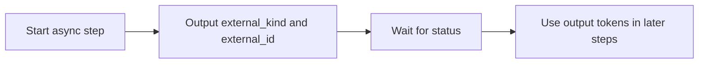

# Custom Workflow Contract

Workflow monitor showing custom workflow definitions and run diagnostics.

Reference for custom workflow definitions, step metadata, output envelopes, and persisted state.

## Core Concepts

| Concept | Source | Description |
|---------|--------|-------------|
| Workflow definition | `WorkflowDefinition` | Saved workflow owned by a project |
| Workflow revision | `WorkflowDefinitionRevision` | Versioned snapshot of a definition |
| Workflow run | `WorkflowRun` | One execution of a workflow definition |
| Workflow run step | `WorkflowRunStep` | Persisted execution state for one step |
| Workflow schedule | `WorkflowSchedule` | Recurring execution configuration |
| Workflow event | `WorkflowEvent` | Audit and lifecycle event stream |
| Step type | `WorkflowStepType` | Catalog metadata used by builder, validation, and execution |

## Step Definition Shape

Workflow definitions store an ordered list of step objects.

| Field | Type | Notes |
|-------|------|-------|
| `key` | string | Required. Unique within the workflow; letters, numbers, dashes, and underscores |
| `type` | string | Required. Must match a registered step type |
| `input` | object | Required. Validated against the step type input schema |
| `label` | string | Optional. Defaults to the step type label |
| `continue_on_error` | boolean | Optional. Allows later steps to continue when supported |
| `recovery_policy` | object | Optional. Controls failure handling |

Validation is implemented in `orchestrator/services/workflow_runner.py`.

## Step Type Metadata

Built-in and persisted step types use the same contract.

| Field | Description |
|-------|-------------|
| `type` | Stable step type identifier |
| `version` | Step type version |
| `label` | Human-readable builder label |
| `description` | Short builder description |
| `category` | Builder grouping |
| `risk_level` | Risk label for review and UI messaging |
| `is_async` | Whether the step starts child work that should be waited on |
| `auto_wait_defaults` | Default timeout and polling interval for async waits |
| `required` | Required input keys |
| `default_input` | Builder defaults |
| `input_schema` | JSON Schema for validation |
| `ui_schema` | Dashboard field controls and recommendations |
| `handler_kind` | Handler family, usually `builtin` for built-ins |
| `handler_config` | Backend action metadata |
| `output_schema` | Token and output catalog for downstream references |

Built-in metadata is defined in `orchestrator/services/workflow_step_registry.py` and synced to the database at startup.

## Standard Output Envelope

Step outputs are normalized by `orchestrator/services/workflow_output_contract.py`.

| Field | Type | Description |
|-------|------|-------------|
| `contract_version` | integer | Required. Current standard version |
| `status` | string or null | Required. Step or child job status |
| `external_kind` | string or null | Optional. Linked child job type |
| `external_id` | string or null | Optional. Linked child job identifier |
| `summary` | string or null | Optional. Human-readable result |
| `artifacts` | array | Required. Produced artifacts |
| `metrics` | object | Required. Numeric or structured metrics |
| `structured_report` | any | Optional. Domain-specific report payload |
| `diagnostics` | object | Required. Warnings, child status, or error message |
| `data` | object | Required. Structured domain data |
| `raw` | any | Optional. Original payload when preserved |

Legacy top-level fields are preserved when outputs are normalized, so saved workflows can keep using older token paths.

## Standard Output Tokens

The standard token catalog includes:

| Token | Meaning |
|-------|---------|
| `status` | Step or child job status |
| `external_kind` | Child job type |
| `external_id` | Child job ID |
| `summary` | Human-readable summary |
| `artifacts` | Artifact list |
| `metrics` | Metrics object |
| `structured_report` | Domain-specific structured report |

Step types can add extra tokens such as `session_id` or `job_id`.

## Recovery Actions

| Action | Meaning |
|--------|---------|
| `fail` | Mark the workflow failed |
| `retry` | Retry the failed step with configured backoff |
| `skip` | Skip the failed step and continue |
| `pause` | Pause the workflow for human intervention |
| `notify` | Emit a notification event |

Recovery policy validation lives in `orchestrator/services/workflow_runner.py`.

## Async Step Pattern

Async steps should usually be followed by a wait step that references the source step. The validator warns when an async step is not followed by a matching wait.

## Related

- [Temporal Orchestration](../explanation/temporal-orchestration.md)
- [API Router and Service Map](api-router-service-map.md)
- [Database Schema](database-schema.md)
- [Web Dashboard](web-dashboard.md)
