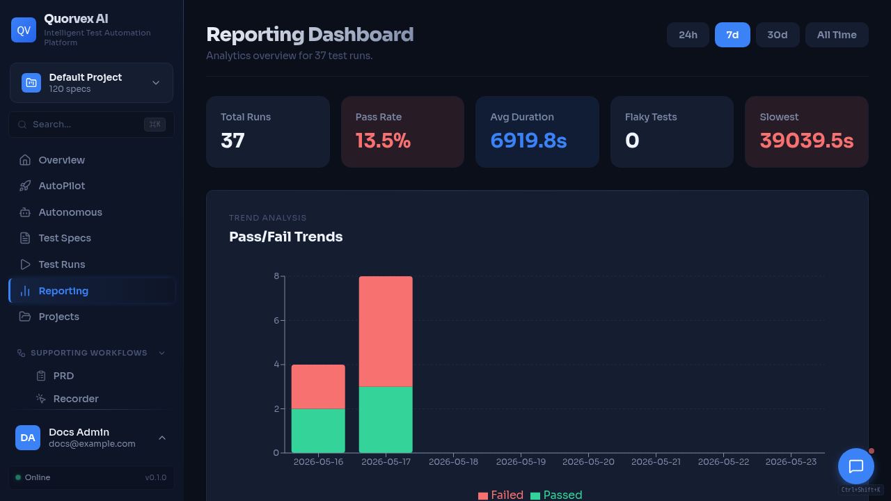

# Makefile Reference



<p class="caption">Quorvex dashboard shown after running local development commands.</p>


Complete reference for all `make` targets in Quorvex AI.

## Setup & Development

| Command | Description | Prerequisites | Example |
|---------|-------------|---------------|---------|
| `make setup` | Install Python venv, Node deps, Playwright browsers, database | -- | `make setup` |
| `make setup-skills` | Install Playwright skill dependencies (npm + Chromium) | `.claude/skills/playwright` directory | `make setup-skills` |
| `make start` | Start the dashboard stack via `make prod-dev` | Docker, `.env.prod` | `make start` |
| `make restart` | Stop and restart the dashboard stack | Docker, `.env.prod` | `make restart` |
| `make dev` | Start backend API (port 8001) + frontend (port 3000) | `make setup` | `make dev` |
| `make run SPEC=...` | Run a specific test spec via CLI (native pipeline) | `make setup`, venv | `make run SPEC=specs/login.md` |
| `make run-skill S=...` | Run a Playwright skill script | `make setup-skills`, venv | `make run-skill S=path/to/script.js` |
| `make load-test SPEC=...` | Generate and run K6 load test from spec | venv, k6 installed | `make load-test SPEC=specs/load/api-test.md` |
| `make agent-temporal-smoke-up` | Start Docker services needed for agent Temporal smoke | Docker | `make agent-temporal-smoke-up` |
| `make agent-temporal-smoke` | Run deterministic standalone agent Temporal smoke | Docker services or equivalent Temporal/Postgres | `make agent-temporal-smoke` |
| `make agent-temporal-smoke-logs` | Tail Temporal and custom workflow worker logs | Docker | `make agent-temporal-smoke-logs` |

## Docker (Development)

| Command | Description | Prerequisites | Example |
|---------|-------------|---------------|---------|
| `make docker-up` | Start all services via Docker Compose | Docker, Docker Compose | `make docker-up` |
| `make docker-down` | Stop all Docker services | Docker | `make docker-down` |
| `make docker-build` | Rebuild Docker images (no cache) | Docker | `make docker-build` |
| `make dev-k6-workers-up` | Start dev K6 workers (volume-mounted code) | Docker | `make dev-k6-workers-up` |
| `make dev-k6-workers-down` | Stop dev K6 workers | Docker | `make dev-k6-workers-down` |
| `make dev-k6-workers-logs` | Tail dev K6 worker logs | Docker | `make dev-k6-workers-logs` |

## Docker (Production)

| Command | Description | Prerequisites | Example |
|---------|-------------|---------------|---------|
| `make prod-up` | Start production services (standard + VNC + nginx) | Docker, `.env.prod` | `make prod-up` |
| `make prod` | Alias for `make prod-up` | Docker, `.env.prod` | `make prod` |
| `make prod-dev` | Start production with local code mounting (auto-reload) | Docker, `.env.prod` | `make prod-dev` |
| `make prod-down` | Stop production services (30s graceful timeout) | Docker | `make prod-down` |
| `make prod-down-safe` | Stop with backup first | Docker | `make prod-down-safe` |
| `make prod-restart` | Restart backend (picks up code changes) | Docker | `make prod-restart` |
| `make prod-logs` | Tail backend and frontend logs | Docker | `make prod-logs` |
| `make prod-build` | Rebuild production images (with cache) | Docker | `make prod-build` |
| `make prod-build-no-cache` | Rebuild production images (fresh, no cache) | Docker | `make prod-build-no-cache` |
| `make prod-status` | Show service status and health | Docker | `make prod-status` |

### Production Services

`make prod-up` starts:

| Service | Port | Description |
|---------|------|-------------|
| Dashboard | 3000 (direct), 80 (nginx) | Next.js frontend |
| API | 8001 | FastAPI backend |
| API Docs | 8001/docs | Swagger UI |
| PostgreSQL | internal, host depends on compose file | Primary production database |
| Redis | internal | Queues, workers, rate limiting, distributed execution |
| VNC View | 6080 | Live browser view (websockify) |
| MinIO API | 9000 | S3-compatible artifact and backup storage |
| MinIO Console | 9001 | Object storage admin |
| Temporal | 7233 | Durable workflow engine for autonomous missions, custom workflows, and standalone agent runs |
| Temporal UI | 8233 | Workflow inspection UI |

!!! warning
    `.env.prod.example` contains development-friendly defaults. Change `JWT_SECRET_KEY`, database passwords, MinIO passwords, and initial admin credentials before using `make prod-up` for a real deployment.

## Auto Pilot Runtime

| Command | Description | Prerequisites | Example |
|---------|-------------|---------------|---------|
| `make autopilot-stable-up` | Start the stable local Auto Pilot stack with lower concurrency and no backend reload | Docker, `.env.prod`, 12 GB+ Docker memory | `make autopilot-stable-up` |
| `make autopilot-stable-down` | Stop the stable Auto Pilot stack | Docker | `make autopilot-stable-down` |
| `make autopilot-dev-up` | Start Auto Pilot in dev mode via `make prod-dev` | Docker, `.env.prod` | `make autopilot-dev-up` |
| `make autopilot-status` | Show service status, container memory, and backend health | Docker | `make autopilot-status` |
| `make autopilot-logs` | Tail Auto Pilot backend and frontend logs | Docker | `make autopilot-logs` |

## Backup & Recovery

| Command | Description | Prerequisites | Example |
|---------|-------------|---------------|---------|
| `make backup` | Database-only backup | `make prod-up` | `make backup` |
| `make backup-full` | Full backup (DB + specs + tests + PRDs + ChromaDB) | `make prod-up` | `make backup-full` |
| `make backup-status` | Show backup status and history | `make prod-up` | `make backup-status` |
| `make restore-list` | List available backups | `make prod-up` | `make restore-list` |
| `make restore TS=...` | Restore from specific timestamp | `make prod-up` | `make restore TS=20240115_143022` |
| `make restore-from-minio TS=...` | Download and restore from MinIO | `make prod-up`, MinIO | `make restore-from-minio TS=20240115_143022` |

## Storage Management

| Command | Description | Prerequisites | Example |
|---------|-------------|---------------|---------|
| `make storage-health` | Check storage health (DB, MinIO, local) | `make prod-up` | `make storage-health` |
| `make archival` | Run artifact archival (30-day retention) | `make prod-up` | `make archival` |
| `make archival-dry-run` | Preview archival without changes | `make prod-up` | `make archival-dry-run` |
| `make minio-console` | Open MinIO console in browser | `make prod-up` | `make minio-console` |

## Browser Workers

| Command | Description | Prerequisites | Example |
|---------|-------------|---------------|---------|
| `make workers-build` | Build browser worker images | Docker | `make workers-build` |
| `make workers-up` | Start with isolated browser workers (default: 4) | Docker, `.env.prod` | `make workers-up` |
| `make workers-down` | Stop browser worker services | Docker | `make workers-down` |
| `make workers-scale N=...` | Scale browser workers | Docker | `make workers-scale N=8` |
| `make workers-status` | Check worker status and resource usage | Docker | `make workers-status` |
| `make workers-logs` | Tail browser and agent worker logs | Docker | `make workers-logs` |

Default workers: `WORKERS=4` (overridable).

## K6 Load Test Workers

| Command | Description | Prerequisites | Example |
|---------|-------------|---------------|---------|
| `make k6-workers-up` | Start K6 worker containers | Docker, `.env.prod` | `make k6-workers-up` |
| `make k6-workers-down` | Stop K6 workers | Docker | `make k6-workers-down` |
| `make k6-workers-scale N=...` | Scale K6 workers | Docker | `make k6-workers-scale N=3` |
| `make k6-workers-status` | Check K6 worker status and resources | Docker | `make k6-workers-status` |
| `make k6-workers-logs` | Tail K6 worker logs | Docker | `make k6-workers-logs` |

Default K6 workers: `K6_WORKERS=1` (overridable).

## Security Testing (ZAP)

| Command | Description | Prerequisites | Example |
|---------|-------------|---------------|---------|
| `make zap-up` | Start OWASP ZAP security scanner daemon | Docker | `make zap-up` |
| `make zap-down` | Stop ZAP scanner | Docker | `make zap-down` |
| `make zap-status` | Check ZAP scanner status and API health | Docker | `make zap-status` |
| `make zap-logs` | Tail ZAP logs | Docker | `make zap-logs` |

## Docker Swarm (Enterprise)

| Command | Description | Prerequisites | Example |
|---------|-------------|---------------|---------|
| `make swarm-up` | Deploy to Docker Swarm | Docker Swarm initialized | `make swarm-up` |
| `make swarm-down` | Remove Swarm stack | Docker Swarm | `make swarm-down` |
| `make swarm-scale N=...` | Scale Swarm browser workers | Docker Swarm | `make swarm-scale N=8` |
| `make swarm-status` | Check Swarm service and task status | Docker Swarm | `make swarm-status` |

## Kubernetes (Enterprise)

| Command | Description | Prerequisites | Example |
|---------|-------------|---------------|---------|
| `make k8s-deploy` | Deploy to Kubernetes | `kubectl`, `k8s/` manifests | `make k8s-deploy` |
| `make k8s-delete` | Delete Kubernetes deployment | `kubectl` | `make k8s-delete` |
| `make k8s-status` | Check pods, services, HPA, ingress | `kubectl` | `make k8s-status` |
| `make k8s-scale N=...` | Scale Kubernetes browser workers | `kubectl` | `make k8s-scale N=8` |
| `make k8s-logs` | Tail Kubernetes logs (interactive service selection) | `kubectl` | `make k8s-logs` |

Default namespace: `K8S_NAMESPACE=quorvex` (overridable).

## Database Migrations

| Command | Description | Prerequisites | Example |
|---------|-------------|---------------|---------|
| `make db-migrate M=...` | Generate new Alembic migration | PostgreSQL, Alembic | `make db-migrate M="add user preferences"` |
| `make db-upgrade` | Run pending migrations | PostgreSQL, Alembic | `make db-upgrade` |
| `make db-downgrade` | Roll back one migration | PostgreSQL, Alembic | `make db-downgrade` |
| `make db-history` | Show migration history | PostgreSQL, Alembic | `make db-history` |
| `make db-stamp R=...` | Stamp DB at revision (for existing DBs) | PostgreSQL, Alembic | `make db-stamp R=001` |
| `make db-demo-seed` | Seed Database Testing demo content | PostgreSQL dev database | `make db-demo-seed` |

## Linting & Testing

| Command | Description | Prerequisites | Example |
|---------|-------------|---------------|---------|
| `make lint` | Run Python linting (ruff) + frontend linting (next lint) | venv, node_modules | `make lint` |
| `make format` | Format Python code (ruff format) | venv | `make format` |
| `make test` | Run all Python tests (`pytest tests/ -v`) | venv | `make test` |

## Documentation

| Command | Description | Prerequisites | Example |
|---------|-------------|---------------|---------|
| `make docs-check` | Run docs drift checks and a strict MkDocs build | `requirements-docs.txt` | `make docs-check` |
| `make docs-visual-check` | Verify every published page has a local UI screenshot or GIF | `docs/assets/ui/` | `make docs-visual-check` |
| `make docs-visual-capture` | Capture dashboard UI screenshots into committed docs assets | running dashboard | `BASE_URL=http://localhost:3000 make docs-visual-capture` |
| `make docs-serve` | Start MkDocs development server | `requirements-docs.txt` | `make docs-serve` |
| `make docs-build` | Build MkDocs documentation (strict mode) | `requirements-docs.txt` | `make docs-build` |
| `make docs-deploy` | Deploy docs to GitHub Pages | `requirements-docs.txt` | `make docs-deploy` |

## YouTube Production

| Command | Description | Prerequisites | Example |
|---------|-------------|---------------|---------|
| `make youtube-pack EP=...` | Generate an episode script, avatar lines, captions, metadata, shot list, and checklist | `content/youtube/episode-catalog.json` | `make youtube-pack EP=001` |
| `make youtube-voice EP=...` | Generate ElevenLabs voiceover for an episode script | `ELEVENLABS_API_KEY`, episode pack | `make youtube-voice EP=001` |
| `make youtube-avatar EP=...` | Generate HeyGen avatar payloads for short presenter clips | `HEYGEN_AVATAR_ID`, `HEYGEN_VOICE_ID` | `make youtube-avatar EP=001` |
| `make youtube-assemble EP=... RECORDING=...` | Export a 1080p YouTube MP4 from a screen recording, episode voiceover, and captions | `ffmpeg`, generated voiceover | `make youtube-assemble EP=001 RECORDING=recording.mp4` |

## Maintenance & Operations

| Command | Description | Prerequisites | Example |
|---------|-------------|---------------|---------|
| `make upgrade` | Full upgrade: backup, pull, migrate, rebuild, restart | Docker, `.env.prod` | `make upgrade` |
| `make health-check` | Hit all health endpoints and report status | Services running | `make health-check` |
| `make docker-prune` | Remove dangling images, stopped containers, build cache | Docker | `make docker-prune` |
| `make volume-sizes` | Show sizes of all Docker volumes | Docker | `make volume-sizes` |
| `make db-vacuum` | Run VACUUM ANALYZE on PostgreSQL | Docker, PostgreSQL | `make db-vacuum` |
| `make deps-lock` | Capture current venv versions to requirements.freeze | venv | `make deps-lock` |

### Upgrade Procedure (`make upgrade`)

| Step | Action |
|------|--------|
| 1 | Pre-flight health check |
| 2 | Full backup |
| 3 | `git pull` latest code |
| 4 | Rebuild images |
| 5 | Run database migrations |
| 6 | Restart services and verify health |

## Utilities

| Command | Description | Prerequisites | Example |
|---------|-------------|---------------|---------|
| `make check-env` | Validate environment configuration (.env, .env.prod, venv, deps) | -- | `make check-env` |
| `make logs` | Tail backend and frontend logs | Services running | `make logs` |
| `make stop` | Stop all running services (graceful then force) | -- | `make stop` |
| `make clean` | Remove run artifacts and logs (`runs/*`, `api.log`, `web.log`) | -- | `make clean` |

## Makefile Variables

| Variable | Default | Description |
|----------|---------|-------------|
| `DOCKER_COMPOSE` | `docker compose` | Docker Compose command |
| `PROD_COMPOSE` | `docker compose --env-file .env.prod -f docker-compose.prod.yml` | Production compose command |
| `WORKERS` | `4` | Default browser worker count |
| `K6_WORKERS` | `1` | Default K6 worker count |
| `K8S_NAMESPACE` | `quorvex` | Kubernetes namespace |

Override any variable:

```bash
make workers-up WORKERS=8
make k6-workers-scale N=3
make k8s-deploy K8S_NAMESPACE=staging
```

## Related

- [CLI Reference](cli.md)
- [Environment Variables](environment-variables.md)
