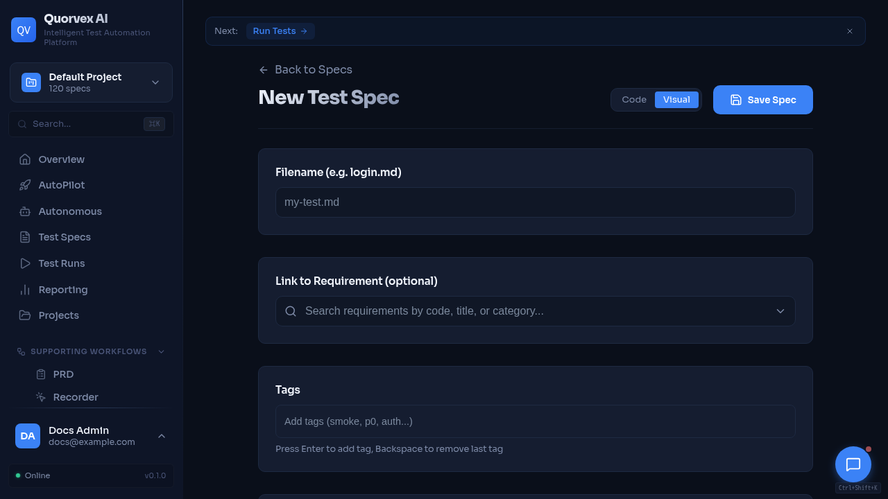

# Curated Examples

Spec editor dashboard for writing and reviewing maintained examples.

Use these maintained examples when evaluating Quorvex AI or checking how generated artifacts should look. They are intentionally fewer than the full `specs/` tree so new readers land on examples that are current and useful.

| Example | Shows | Source |
|---------|-------|--------|
| Login spec to Playwright output | Plain-English UI flow, generated Playwright style, assertions | [Input spec](https://github.com/NihadMemmedli/quorvex_ai/blob/main/demo/example_spec.md), [generated output](https://github.com/NihadMemmedli/quorvex_ai/blob/main/demo/example_output.spec.ts) |
| Minimal hello-world spec | Smallest evaluator-friendly spec shape | [specs/examples/hello-world.md](https://github.com/NihadMemmedli/quorvex_ai/blob/main/specs/examples/hello-world.md) |
| Authenticated demo-shop flow | Credential-aware flow structure without hardcoding secrets | [specs/quorvex-demo-shop/auth/login-session-recovery.md](https://github.com/NihadMemmedli/quorvex_ai/blob/main/specs/quorvex-demo-shop/auth/login-session-recovery.md) |
| API plan from OpenAPI input | API operation planning and generated API spec structure | [specs/generated/api/openapi-plan.md](https://github.com/NihadMemmedli/quorvex_ai/blob/main/specs/generated/api/openapi-plan.md) |
| Generated Playwright tests | Real generated test files for review and CI execution | [tests/generated/](https://github.com/NihadMemmedli/quorvex_ai/tree/main/tests/generated) |

## How To Use These Examples

For the fastest local check, start with Minimal Docker and run the hello-world spec from the dashboard. For code review, compare the login input spec with the generated Playwright output. For production-style coverage, review the authenticated demo-shop and API examples, then adapt the pattern to your own app and secrets.

Keep real credentials in `.env`, `.env.prod`, `.env.local`, `.secrets/`, or your shell environment. Specs should use placeholders instead of literal passwords or tokens.
